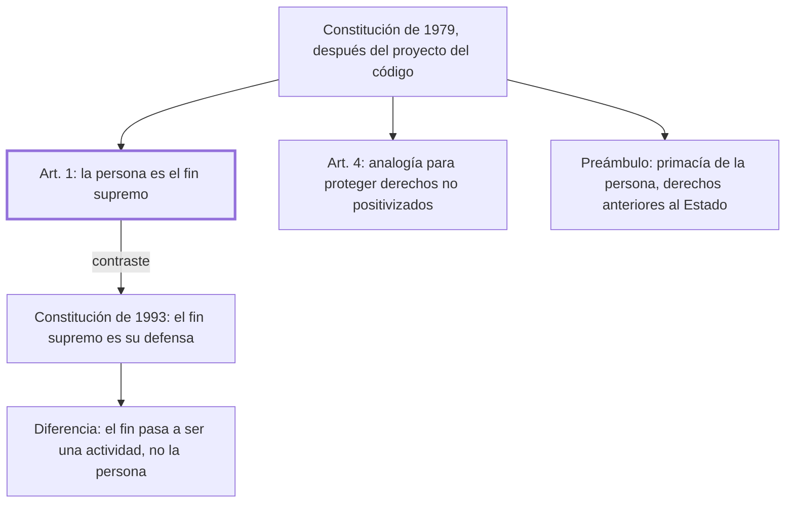

# § 65. El preámbulo personalista de la derogada constitución peruana de 1979

## 1. Idea principal

La Constitución de 1979 decía que la persona es el fin supremo de la sociedad y del Estado; la de 1993 pone en ese lugar su defensa, que es un medio y no un fin.

Contesta si el personalismo fue solo del Código Civil o llegó también al nivel constitucional. Y muestra cómo un cambio de redacción aparentemente menor desplaza el centro de un ordenamiento.

## 2. Lo esencial del capítulo

El personalismo aparece también en la Constitución de 1979, elaborada después de que se publicara parcialmente el proyecto del código que se promulgaría en 1984 (p. 159). Su artículo 1 declara que **la persona es el fin supremo de la sociedad y del Estado**, y de ahí deriva la obligación de todos de respetarla y protegerla. El segundo apoyo es más técnico: el artículo 4 establece el deber de tutelar cualquier interés o derecho natural sustentado en la dignidad del ser humano, y autoriza explícitamente a usar la analogía para proteger derechos de la persona que el ordenamiento positivo no recoge. Es la solución al problema de que ninguna lista de derechos alcanza: en vez de enumerar más, habilita a extender la protección a lo no previsto.

El contraste con la Constitución de 1993 descansa en una diferencia de redacción que conviene leer despacio. La de 1979 pone como fin supremo a la persona en sí misma; la de 1993 dice que el fin supremo es "la defensa de la persona humana y el respeto a su dignidad" (p. 160), con lo que ya no ocupa ese lugar la persona sino el instrumento del que nos valemos: el fin pasa a ser una actividad —defender, respetar— y la persona queda como su objeto. Conviene notar que el autor no argumenta la consecuencia práctica de esa diferencia; la califica de "notoria" y sigue. Cierra recorriendo el Preámbulo de 1979, que reconoce "la primacía de la persona humana" y derechos de validez universal "anteriores y superiores al Estado" —fórmula de raíz iusnaturalista que encaja con el crédito que el autor le dio a esa escuela—, junto con sus declaraciones sobre la familia, el trabajo, la justicia y el bien común, que conviene leer en el original (pp. 160-161).

## 3. Mapa

## 4. Vocabulario clave

- **Fin supremo de la sociedad y del Estado** — la fórmula del art. 1 de 1979: aquello a cuyo servicio están las instituciones.
- **Preámbulo** — la declaración inicial de una constitución, que fija sus principios sin ser articulado exigible.
- **Analogía** — aplicar a un caso no previsto la solución de uno semejante; el art. 4 la autoriza para proteger derechos de la persona.
- **Derechos anteriores y superiores al Estado** — la fórmula del Preámbulo: derechos que el Estado reconoce, no que crea.

## 5. Distinciones que se confunden

- **La persona como fin vs. su defensa como fin** — es la diferencia entre las dos constituciones y no es una sutileza de redacción.
  - Se confunden porque: las dos fórmulas suenan protectoras y las dos nombran a la persona.
  - Criterio para decidir: ¿qué ocupa el lugar del fin, la persona o una actividad sobre ella? Si es la defensa, la persona pasa a ser su objeto.
  - Dónde se cae: se citan las dos constituciones como igualmente personalistas, cuando el autor sostiene que la de 1993 desplazó el centro.

- **Enumerar derechos vs. habilitar la analogía** — lo primero cierra una lista; lo segundo permite proteger lo no previsto.
  - Se confunden porque: las dos técnicas buscan ampliar la protección de la persona.
  - Criterio para decidir: ¿el derecho invocado tiene que estar en el texto? Con la analogía no hace falta.
  - Dónde se cae: se lee el art. 4 como una declaración de principios, cuando es una regla operativa de interpretación.

## 6. Autoevaluación

1. ¿Qué se entiende por el personalismo de la Constitución peruana de 1979? Explique cómo lo formula su articulado y cuáles son sus implicaciones frente a la fórmula de 1993.
2. Alguien reclama la protección de un interés que ninguna norma menciona, pero que se apoya en la dignidad. Bajo la Constitución de 1979, ¿qué herramienta tiene el juez?

--- No mires esto hasta responder ---

1. El personalismo constitucional consiste en poner a la persona, y no al Estado ni al patrimonio, como aquello a cuyo servicio están las instituciones. La Constitución de 1979 lo formula en su artículo 1: la persona es el fin supremo de la sociedad y del Estado, de donde deriva la obligación de todos de respetarla y protegerla (p. 159). Lo completan el artículo 4, que impone tutelar cualquier interés sustentado en la dignidad y autoriza la analogía para proteger derechos que el ordenamiento positivo no recoge, y el Preámbulo, que reconoce la primacía de la persona humana y derechos "anteriores y superiores al Estado". La implicación se ve en el contraste con la Constitución de 1993, que pone como fin supremo "la defensa de la persona humana y el respeto a su dignidad" (p. 160): ahí el fin es una actividad y la persona queda como su objeto, o sea como el medio del que nos valemos. El autor califica la diferencia de "notoria" sin mostrar una consecuencia práctica.
2. La analogía: el art. 4 autoriza explícitamente a usarla para proteger derechos de la persona no recogidos en el ordenamiento positivo, junto con el deber de tutelar todo interés sustentado en la dignidad (p. 159). No hace falta que el derecho invocado esté enumerado en el texto, que es la diferencia entre cerrar una lista y habilitar la extensión a lo no previsto.

## Flashcards

Qué declara el art. 1 de la Constitución peruana de 1979 | Que la persona es el fin supremo de la sociedad y del Estado
Cómo formula el fin supremo la Constitución de 1993 | Como la defensa de la persona humana y el respeto a su dignidad
Qué autoriza el art. 4 de la Constitución de 1979 | Usar la analogía para proteger derechos de la persona no recogidos en el ordenamiento
