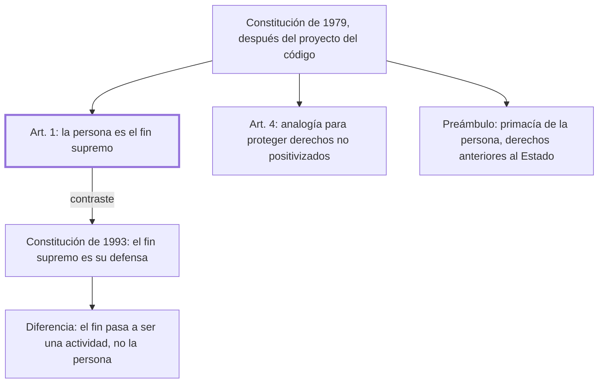

# § 65. El preámbulo personalista de la derogada constitución peruana de 1979

## 1. Idea principal

La Constitución de 1979 decía que la persona es el fin supremo de la sociedad y del Estado; la de 1993 pone en ese lugar su defensa, que es un medio y no un fin.

Contesta si el personalismo fue solo del Código Civil o llegó también al nivel constitucional. Y muestra cómo un cambio de redacción aparentemente menor desplaza el centro de un ordenamiento.

## 2. Lo esencial del capítulo

El personalismo aparece también en la Constitución de 1979, elaborada después de que se publicara parcialmente el proyecto del código que se promulgaría en 1984 (p. 159). Su artículo 1 declara que **la persona es el fin supremo de la sociedad y del Estado**, y de ahí deriva la obligación de todos de respetarla y protegerla.

El segundo apoyo está en su artículo 4, y es más técnico: establece el deber de tutelar cualquier interés o derecho natural sustentado en la dignidad del ser humano, y autoriza explícitamente a usar la analogía para proteger derechos de la persona que el ordenamiento positivo no recoge. Es la solución al problema de que ninguna lista de derechos alcanza: en vez de enumerar más, habilita a extender la protección a lo no previsto.

El contraste con la Constitución de 1993 es el punto central, y descansa en una diferencia de redacción que conviene leer despacio. La de 1979 dice que el fin supremo es la persona, en sí misma. La de 1993 dice que el fin supremo es "la defensa de la persona humana y el respeto a su dignidad" (p. 160). Para el autor eso ya no pone a la persona en el lugar del fin sino al instrumento del que nos valemos para cumplir ese propósito: el fin pasa a ser una actividad —defender, respetar— y la persona queda como su objeto. Conviene notar que el autor no argumenta la consecuencia práctica de esa diferencia; la califica de "notoria" y sigue.

El resto del capítulo recorre el Preámbulo de 1979, que reconoce "la primacía de la persona humana" y que todos los hombres, iguales en dignidad, tienen derechos de validez universal "anteriores y superiores al Estado" —una fórmula de raíz iusnaturalista que encaja con el crédito que el autor le dio a esa escuela—. El Preámbulo declara además a la familia como célula básica de la sociedad, al trabajo como deber y derecho de todos y base del bienestar general, y a la justicia como valor primario de la vida en comunidad, con el ordenamiento cimentado en el bien común y la solidaridad. El autor elogia a los constituyentes de 1979 y sus párrafos de apoyo a la democracia y a la integración latinoamericana. La lista completa de declaraciones está en las pp. 160-161; no la repito.

## 3. Mapa

## 4. Vocabulario clave

- **Fin supremo de la sociedad y del Estado** — la fórmula del art. 1 de 1979: aquello a cuyo servicio están las instituciones.
- **Preámbulo** — la declaración inicial de una constitución, que fija sus principios sin ser articulado exigible.
- **Analogía** — aplicar a un caso no previsto la solución de uno semejante; el art. 4 la autoriza para proteger derechos de la persona.
- **Derechos anteriores y superiores al Estado** — la fórmula del Preámbulo: derechos que el Estado reconoce, no que crea.

## 5. Distinciones que se confunden

- **La persona como fin vs. su defensa como fin** — es la diferencia entre las dos constituciones y no es una sutileza de redacción.
  - Se confunden porque: las dos fórmulas suenan protectoras y las dos nombran a la persona.
  - Criterio para decidir: ¿qué ocupa el lugar del fin, la persona o una actividad sobre ella? Si es la defensa, la persona pasa a ser su objeto.
  - Dónde se cae: se citan las dos constituciones como igualmente personalistas, cuando el autor sostiene que la de 1993 desplazó el centro.

- **Enumerar derechos vs. habilitar la analogía** — lo primero cierra una lista; lo segundo permite proteger lo no previsto.
  - Se confunden porque: las dos técnicas buscan ampliar la protección de la persona.
  - Criterio para decidir: ¿el derecho invocado tiene que estar en el texto? Con la analogía no hace falta.
  - Dónde se cae: se lee el art. 4 como una declaración de principios, cuando es una regla operativa de interpretación.

## 6. Autoevaluación

1. Alguien reclama la protección de un interés que ninguna norma menciona, pero que se apoya en la dignidad. Bajo la Constitución de 1979, ¿qué herramienta tiene el juez?
2. Un compañero dice que las Constituciones de 1979 y 1993 dicen lo mismo con otras palabras. ¿Qué le respondería el autor?
3. El autor califica de "notoria" la diferencia entre las dos fórmulas pero no muestra una consecuencia práctica. ¿Qué le falta al argumento?
4. El Preámbulo habla de derechos "anteriores y superiores al Estado". ¿Es coherente con el resto de la posición del autor?

--- No mires esto hasta responder ---

1. La analogía: el art. 4 autoriza explícitamente a usarla para proteger derechos de la persona no recogidos en el ordenamiento positivo, junto con el deber de tutelar todo interés sustentado en la dignidad (p. 159).
2. Que no: en 1979 el fin supremo es la persona en sí misma, y en 1993 lo es su defensa y el respeto a su dignidad. En la segunda el fin es una actividad y la persona queda como su objeto, o sea el medio para cumplir el propósito (p. 160).
3. Le falta mostrar qué se decide distinto con una u otra fórmula: un caso, una interpretación, una jurisprudencia. Sin eso la diferencia es de redacción y el lector no puede medir su peso. Discutible: puede sostenerse que en un texto constitucional la jerarquía declarada tiene efecto por sí misma sobre toda la interpretación.
4. Sí, aunque venga del vocabulario iusnaturalista. El autor le reconoce a esa escuela el mérito de haber mostrado que hay ideales que el derecho positivo debe recoger; lo que rechaza es reducir el derecho a esos ideales, no que existan.

## Flashcards

Qué declara el art. 1 de la Constitución peruana de 1979 | Que la persona es el fin supremo de la sociedad y del Estado
Qué autoriza el art. 4 de la Constitución de 1979 | Usar la analogía para proteger derechos de la persona no recogidos en el ordenamiento
Cómo formula el fin supremo la Constitución de 1993 | Como la defensa de la persona humana y el respeto a su dignidad
Por qué el autor prefiere la fórmula de 1979 | Porque pone a la persona como fin, no a una actividad sobre ella
Qué reconoce el Preámbulo de 1979 sobre los derechos | Que son de validez universal, anteriores y superiores al Estado
Qué dice el Preámbulo de 1979 sobre la familia | Que es la célula básica de la sociedad y raíz de su grandeza
Cómo distingo la persona como fin de su defensa como fin | En la segunda el fin es una actividad y la persona pasa a ser su objeto
Cómo distingo enumerar derechos de habilitar la analogía | Enumerar cierra una lista; la analogía permite proteger lo no previsto
