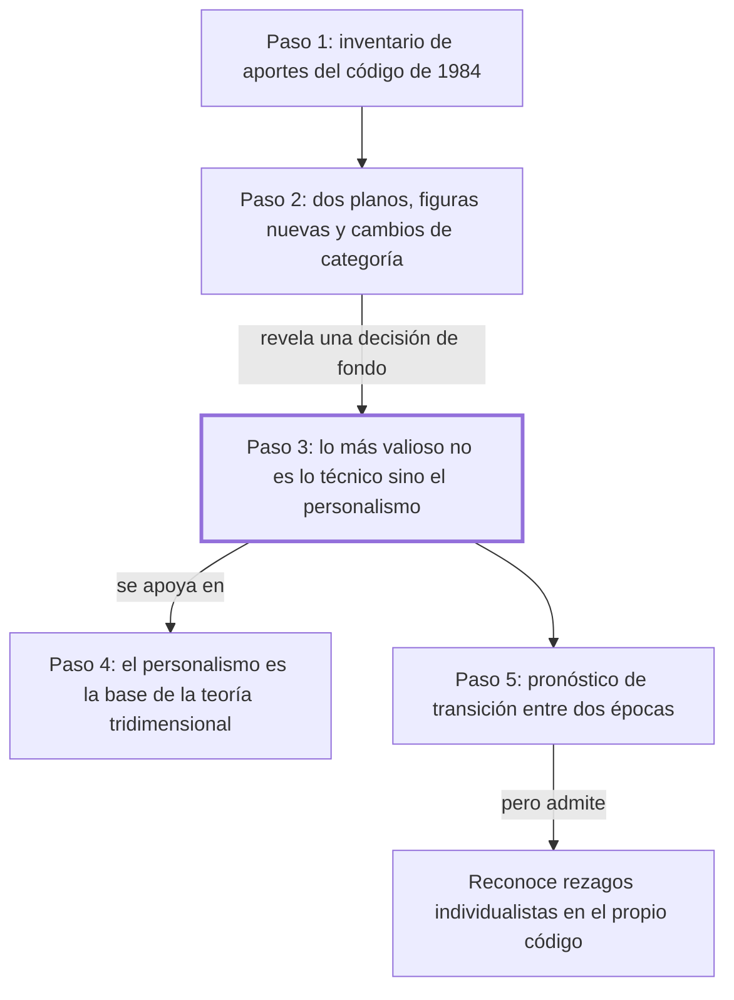

# § 66. Los significativos aportes del código civil peruano de 1984 + § 67. El personalismo del código civil 1984

## 1. Idea principal

El aporte más duradero del Código Civil peruano de 1984 no son sus figuras nuevas sino su personalismo: pone a la persona donde los códigos del siglo XIX ponían el patrimonio.

Estos dos capítulos contestan qué cambió ese código y por qué al autor le importa tanto. A un principiante le conviene entenderlos porque acá se conecta la teoría de los capítulos anteriores con una ley concreta: es el momento en que el tridimensionalismo deja de ser filosofía y se vuelve articulado. Además, el autor sostiene que la concepción personalista fue la condición para poder formular esa teoría, no su consecuencia.

## 2. Explicación paso a paso

### Paso 1 — Lista los aportes del código y anuncia el plan

El § 66 abre con "son varios los sustanciales y novedosos aportes del Código Civil peruano de 1984" (pp. 161-162). El movimiento es de inventario y de anuncio: el autor enumera lo que viene y avisa que los parágrafos siguientes lo desarrollan. Nombra el daño a la persona con su especie más original, el daño al proyecto de vida; la nueva categorización del sujeto de derecho —sujeto de derecho es todo aquel a quien el ordenamiento le atribuye derechos y deberes— con dos figuras nuevas, el concebido y la organización de personas no inscripta; y la incorporación del comité como persona jurídica. La lista completa está en el original y no la repito: conviene leerla ahí, porque cada ítem tiene su propio parágrafo más adelante. Importa porque este capítulo es el índice de todo el apartado, no su desarrollo.

### Paso 2 — Ordena la novedad en dos planos distintos

Sigue en el mismo tramo, con "no menos trascendente en el derecho civil comparado" (p. 162). El movimiento es clasificatorio y hay que leerlo con cuidado, porque el autor mezcla dos tipos de aporte: unos son figuras nuevas que antes no existían en el código (el comité, el concebido); otros son cambios de categoría, es decir, reclasificar algo que ya existía en la realidad pero que el derecho no reconocía como sujeto (la organización de personas no inscripta, que antes se llamaba irregular o de hecho). La analogía: una cosa es inventar un tipo de vehículo y otra es reconocer como vehículo a algo que ya circulaba y no tenía registro. Importa porque el segundo tipo de aporte es el que muestra la influencia de la teoría: cambiar quién cuenta como sujeto es una decisión filosófica antes que técnica.

### Paso 3 — Descarta que lo más valioso sean los aportes técnicos

El § 67 arranca reconociendo esos aportes y enseguida hace el movimiento central del capítulo: "más allá de dichos aportes, lo más trascendente y valioso [...] es su inédita inspiración personalista" (pp. 162-163). Es un descarte deliberado: el autor pone en segundo plano lo que acaba de enumerar. Y define en qué consiste ese personalismo por contraste con lo que reemplaza: el intento de revertir la tendencia histórica que hacía de la tutela del individuo aisladamente considerado y del patrimonio la finalidad primordial del código. Notar la diferencia entre "individuo aislado" y "persona", que es toda la apuesta del libro. Conviene ver también que el autor participó de la redacción de ese código, dato que él mismo consigna en nota. Importa porque acá queda claro que la tesis del capítulo es ideológica, no técnica.

### Paso 4 — Invierte la relación entre la teoría y la concepción de la persona

En "la concepción personalista del derecho ha sido la base teórica indispensable" (p. 163) está la bisagra del capítulo y lo más fácil de invertir al estudiarlo. El movimiento es fijar un orden de fundamentación: no es que el tridimensionalismo llevara al personalismo, sino que el personalismo fue la condición para concebir que el objeto de estudio del derecho es la interacción de vida humana social, valores y normas. Y aprovecha para resumir en una línea qué reducía cada escuela rival: el formalismo, el derecho a un conjunto de normas; el iusnaturalismo, a una especulación sobre la justicia; el sociologismo, a una referencia a lo social. Repite después la fórmula de siempre: el derecho no puede reducirse a ninguno de esos aspectos ni prescindir de ninguno. Importa porque establece que la premisa de todo el edificio es una idea sobre el ser humano, no un método.

### Paso 5 — Pronostica y admite las contradicciones del propio código

El cierre hace dos movimientos a la vez. Primero un pronóstico explícito: "Nos atrevemos a predecir" (p. 164) que los historiadores verán a ese código como el producto de una transición entre dos épocas, una individualista y patrimonialista y otra personalista y comunitaria. Y después una concesión que conviene no pasar por alto: el código "mantiene aún algunos rezagos de una concepción extremadamente individualista y patrimonialista" (p. 164). Es decir que el propio autor admite que el código no cumple del todo lo que él le atribuye. Conviene marcar dos cosas del tono: son predicciones sobre lo que dirán otros en el futuro, que no se pueden verificar hoy, y el autor las apoya en "varias autorizadas voces" que no identifica. Importa porque es la parte más débil del capítulo y la más fácil de repetir como si fuera un hecho.

## 3. Mapa

## 4. Vocabulario clave

- **Personalismo humanista** — la concepción que pone a la persona, y no al individuo aislado ni a su patrimonio, como finalidad del derecho.
- **Sujeto de derecho** — todo aquel a quien el ordenamiento le atribuye derechos y deberes; el código de 1984 amplió quiénes entran en la categoría.
- **Daño a la persona** — la categoría genérica que el código incorporó para los perjuicios sufridos por el ser humano mismo, no por sus bienes.
- **Daño al proyecto de vida** — la especie que el autor destaca "por su originalidad a nivel de la doctrina contemporánea" (p. 162): el daño que frustra el plan de vida de alguien.
- **Concebido** — el ser humano ya concebido y todavía no nacido, al que el código reconoce como sujeto de derecho.
- **Organización de personas no inscripta** — la agrupación que actúa en la realidad sin estar registrada; antes se la llamaba irregular o de hecho.
- **Comité** — la organización dedicada a recaudar aportes del público para un fin altruista, incorporada como persona jurídica.
- **Codificación civil comparada** — el conjunto de los códigos civiles de distintos países, tomados como término de comparación.
- **Mentalidad ochocentista** — la del siglo XIX, que según el autor inspiró a los códigos anteriores con su foco en el individuo y el patrimonio.
- **Patrimonialismo** — la orientación que hace del patrimonio, es decir del conjunto de bienes, el centro de la protección jurídica.

## 5. Distinciones que se confunden

- **Persona vs. individuo aislado** — el personalismo protege a la persona en su vida concreta y coexistencial; el individualismo protege a un sujeto abstracto y a sus bienes.
  - Se confunden porque: en el lenguaje corriente persona e individuo son sinónimos, y las dos posturas dicen defender al ser humano.
  - Criterio para decidir: ¿lo que se protege es la realización de la persona, o su esfera y su patrimonio frente a los demás? Si es lo segundo, es individualismo.
  - Dónde se cae: se responde que el código de 1984 es personalista porque protege los derechos individuales, que es exactamente la tendencia que el autor dice que vino a revertir.

- **Aporte técnico vs. inspiración ideológica** — las figuras nuevas son aportes técnicos; el personalismo es la idea de fondo que las ordena.
  - Se confunden porque: el autor enumera las dos cosas seguidas y elogia las dos.
  - Criterio para decidir: ¿esto se puede escribir en un artículo del código, o es el criterio con que se eligió qué artículos escribir? Lo segundo es la inspiración.
  - Dónde se cae: se contesta que para el autor lo más valioso del código es el daño al proyecto de vida, cuando dice expresamente que lo más trascendente está "más allá de dichos aportes" (p. 162).

- **El personalismo funda la teoría vs. la teoría funda el personalismo** — el autor sostiene lo primero: la concepción personalista fue la base para concebir el objeto tridimensional.
  - Se confunden porque: los dos aparecen juntos en todo el libro y se refuerzan, así que el orden parece indistinto.
  - Criterio para decidir: ¿cuál de los dos se presenta como "base teórica indispensable"? En la p. 163 es el personalismo.
  - Dónde se cae: se explica que el autor deduce el personalismo del tridimensionalismo, invirtiendo la fundamentación que el texto afirma.

- **Figura nueva vs. cambio de categoría** — el comité es una figura que el código anterior no regulaba; la organización no inscripta ya existía y cambió de estatuto.
  - Se confunden porque: el autor los presenta juntos como aportes originales, sin marcar que son operaciones distintas.
  - Criterio para decidir: ¿el ente existía antes en la realidad y en el derecho? Si existía en la realidad pero no era sujeto, es un cambio de categoría.
  - Dónde se cae: se afirma que el código creó a las organizaciones de personas no inscriptas, cuando lo que hizo fue reconocerlas como sujetos de derecho.

## 6. Qué releer del original

1. (pp. 161-162) "son varios los sustanciales y novedosos aportes" — es la enumeración completa de los aportes que el paso 1 deliberadamente no reprodujo; sirve de índice de los parágrafos que siguen.
2. (pp. 162-163) "lo más trascendente y valioso del Código Civil peruano de 1984" — es la bisagra del capítulo y la formulación exacta importa: ahí el autor subordina lo técnico a lo ideológico.
3. (p. 163) "la concepción personalista del derecho ha sido la base teórica indispensable" — es el pasaje que más fácil se malentiende, porque fija un orden de fundamentación que se suele invertir.
4. (p. 164) "mantiene aún algunos rezagos de una concepción extremadamente individualista" — es la concesión del autor contra su propia tesis, y por eso conviene leerla textual.
5. (p. 163, nota 43) La nota donde el autor consigna que participó de la creación del código — es el contexto necesario para leer los elogios de este capítulo. Además, este tramo llegó sucio de la conversión: hay un `aseves` suelto al final de la nota.

## 7. Autoevaluación

1. ¿Qué aportes del Código Civil peruano de 1984 enumera el autor en el § 66?
2. Según el autor, ¿qué es lo más trascendente y valioso de ese código?
3. ¿Qué reducía cada una de las tres escuelas rivales, según el resumen del § 67?
4. Explicá con tus palabras qué significa que el código tenga una inspiración personalista.
5. Reformulá el paso 4: ¿cuál es la relación de fundamentación entre el personalismo y la teoría tridimensional?
6. ¿Por qué es necesario el paso 3? ¿Qué se perdería si el autor se quedara solo en el inventario de aportes?
7. Un legislador propone un código centrado en proteger la propiedad y la libertad contractual de cada individuo. Según el criterio del bloque 5, ¿es un código personalista? Justificá.
8. Alguien afirma: "para Fernández Sessarego el gran aporte del código es haber incorporado el daño al proyecto de vida". ¿Qué parte de esa lectura es correcta y qué parte contradice al texto?
9. El autor predice cómo juzgarán los historiadores al código y dice apoyarse en "varias autorizadas voces". ¿Qué tan sostenida está esa afirmación en esta sección?
10. Evaluá la coherencia del capítulo: el autor sostiene que el código es personalista y a la vez admite que mantiene rezagos individualistas. ¿Se contradice?

--- No mires esto hasta responder ---

1. El daño a la persona con su especie el daño al proyecto de vida, la nueva categorización del sujeto de derecho con el concebido y la organización de personas no inscripta, la regulación tridimensional de esas organizaciones y la incorporación del comité como persona jurídica (pp. 161-162).
2. Su inédita inspiración personalista, más allá de sus aportes técnicos y de sus bondades de técnica legislativa (pp. 162-163).
3. El formalismo reducía el derecho a un conjunto de normas; el iusnaturalismo, a una especulación sobre la justicia; el sociologismo, a una única referencia a lo social (p. 163).
4. Que el código toma como finalidad la protección y realización de la persona concreta, en vez de tomar como finalidad la tutela del individuo aislado y de su patrimonio, que es lo que hacían los códigos de inspiración del siglo XIX (pp. 162-163).
5. El personalismo es la base: fue "la base teórica indispensable" para concebir que el objeto de estudio del derecho es la interacción de vida humana social, valores y normas. No es que la teoría tridimensional lleve al personalismo, sino al revés (p. 163).
6. Sin el paso 3 el capítulo sería una lista de novedades técnicas, y el código quedaría como un buen trabajo de redacción. Ese paso es el que convierte al código en un cambio de época y el que lo conecta con la tesis del libro.
7. No lo es: proteger la propiedad y la libertad contractual de cada individuo es precisamente la finalidad individualista y patrimonialista que el autor dice que el código de 1984 vino a revertir.
8. Es correcto que el autor considera al daño al proyecto de vida un aporte original y destacado. Contradice al texto decir que es el gran aporte: el autor afirma expresamente que lo más trascendente está más allá de esos aportes y es la inspiración personalista.
9. Poco sostenida en esta sección. Es un pronóstico sobre lo que dirán los historiadores en el futuro, no verificable hoy, y las "autorizadas voces" no se identifican. La nota al pie remite a otras obras del propio autor, no a terceros que respalden el juicio.
10. No se contradice: sostiene que la inspiración dominante es personalista y que la transición está en curso, no consumada, así que la convivencia con rezagos es parte de su tesis y no una excepción a ella. Respuesta discutible: puede objetarse que sin decir cuáles son esos rezagos ni cuánto pesan, la tesis se vuelve difícil de refutar.

## Flashcards

Cuál es, según el autor, lo más valioso del Código Civil peruano de 1984 | Su inspiración personalista, más allá de sus aportes técnicos
Qué es el personalismo humanista en el derecho | La concepción que pone a la persona, y no al individuo aislado ni al patrimonio, como finalidad
Qué es un sujeto de derecho | Todo aquel a quien el ordenamiento le atribuye derechos y deberes
Qué dos sujetos de derecho nuevos incorporó el código de 1984 | El concebido y la organización de personas no inscripta
Qué es el concebido | El ser humano ya concebido y aún no nacido, reconocido como sujeto de derecho
Cómo se llamaba antes la organización de personas no inscripta | Irregular o de hecho
Qué es el daño al proyecto de vida | El daño que frustra el plan de vida de una persona
Qué figura incorporó el código como persona jurídica, según el § 66 | El comité
A qué reducía el derecho el formalismo, según el resumen del autor | A un simple y totalizante conjunto de normas
A qué reducía el derecho el iusnaturalismo, según el autor | A una especulación sobre la justicia
A qué reducía el derecho el sociologismo, según el autor | A una única referencia a lo social
Qué relación de fundamentación afirma el autor entre personalismo y tridimensionalismo | El personalismo es la base teórica indispensable de la teoría tridimensional
Cómo distingo persona de individuo aislado | El personalismo busca la realización de la persona; el individualismo protege su esfera y su patrimonio
Cómo distingo un aporte técnico de la inspiración ideológica | El técnico se escribe en un artículo; la inspiración es el criterio con que se eligió qué artículos escribir
Cómo distingo una figura nueva de un cambio de categoría | La figura nueva no existía en el código; el cambio de categoría reconoce como sujeto a algo que ya actuaba
Qué mentalidad dice el autor que inspiró a los códigos anteriores | La ochocentista, individualista y patrimonialista
Qué predice el autor sobre cómo verán los historiadores al código de 1984 | Como el producto de una transición entre una época individualista y otra personalista
Qué admite el autor sobre el propio código de 1984 | Que mantiene rezagos de una concepción extremadamente individualista y patrimonialista
Participó el autor en la creación de ese código | Sí, y lo consigna en nota al pie
Es personalista un código centrado en la propiedad y la libertad contractual | No: esa es la finalidad individualista y patrimonialista que el autor dice revertir
