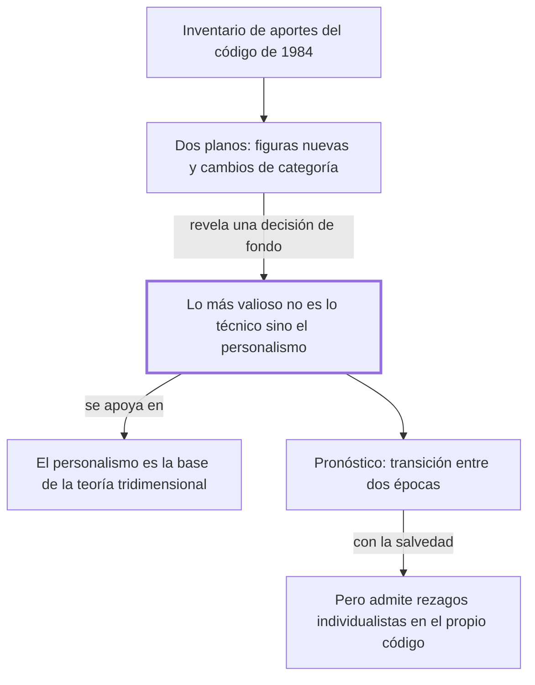

# § 66. Los significativos aportes del código civil peruano de 1984 + § 67. El personalismo del código civil 1984

## 1. Idea principal

El aporte más duradero del Código Civil peruano de 1984 no son sus figuras nuevas sino su personalismo: pone a la persona donde los códigos del siglo XIX ponían el patrimonio.

Estos dos capítulos contestan qué cambió ese código y por qué al autor le importa tanto. Es el momento en que la teoría de los capítulos anteriores deja de ser filosofía y se vuelve articulado.

## 2. Lo esencial del capítulo

El primer parágrafo es un inventario y un anuncio: enumera los aportes del código y avisa que los siguientes los desarrollan (pp. 161-162). Los nombra sin explicarlos: el daño a la persona con su especie más original, el daño al proyecto de vida; la nueva categorización del sujeto de derecho con dos figuras nuevas, el concebido y la organización de personas no inscripta; y la incorporación del comité como persona jurídica. La lista completa está en el original, conviene leerla ahí porque cada ítem tiene su propio parágrafo más adelante.

Hay que notar que ahí se mezclan dos tipos de aporte distintos, sin que el texto lo marque. Unos son figuras que antes no existían en el código, como el comité. Otros son cambios de categoría: reclasificar algo que ya existía en la realidad pero que el derecho no reconocía como sujeto, que es el caso de la organización de personas no inscripta, antes llamada irregular o de hecho (p. 162). Una cosa es inventar un tipo de vehículo y otra reconocer como vehículo a algo que ya circulaba sin registro. El segundo tipo es el que muestra la influencia de la teoría: cambiar quién cuenta como sujeto es una decisión filosófica antes que técnica.

El segundo parágrafo reconoce esos aportes y enseguida los pone en segundo plano, que es el movimiento central: "más allá de dichos aportes, lo más trascendente y valioso [...] es su inédita inspiración personalista" (pp. 162-163). Y define ese personalismo por contraste con lo que reemplaza: el intento de revertir la tendencia histórica que hacía de la tutela del individuo aisladamente considerado y del patrimonio la finalidad primordial del código. La diferencia entre "individuo aislado" y "persona" es toda la apuesta del libro. El autor participó de la redacción de ese código, dato que consigna en nota.

Sigue la bisagra, lo más fácil de invertir al estudiarlo: la concepción personalista "ha sido la base teórica indispensable" para concebir que el objeto de estudio del derecho es la interacción de vida humana social, valores y normas (p. 163). No es que el tridimensionalismo llevara al personalismo, sino al revés: la premisa del edificio es una idea sobre el ser humano, no un método. Aprovecha para resumir qué reducía cada escuela rival —el formalismo a un conjunto de normas, el iusnaturalismo a la justicia, el sociologismo a lo social—. El cierre hace dos cosas: predice que los historiadores verán al código como producto de una transición entre una época individualista y otra personalista (p. 164), y admite que "mantiene aún algunos rezagos de una concepción extremadamente individualista y patrimonialista". Son predicciones sobre lo que dirán otros, apoyadas en "varias autorizadas voces" que no identifica.

## 3. Mapa

## 4. Qué releer del original

1. (pp. 161-162) "son varios los sustanciales y novedosos aportes" — es la enumeración completa que no reproduje, y sirve de índice de los parágrafos que siguen.
2. (p. 163) "la concepción personalista del derecho ha sido la base teórica indispensable" — es el pasaje que más fácil se malentiende: fija un orden de fundamentación que se suele invertir.
3. (p. 164) "mantiene aún algunos rezagos de una concepción extremadamente individualista" — es la concesión del autor contra su propia tesis, y conviene leerla textual.

## 5. Vocabulario clave

- **Personalismo humanista** — la concepción que pone a la persona, y no al individuo aislado ni al patrimonio, como finalidad del derecho.
- **Daño al proyecto de vida** — el daño que frustra el plan de vida de alguien; el autor lo destaca "por su originalidad" (p. 162).
- **Concebido** — el ser humano ya concebido y aún no nacido, al que el código reconoce como sujeto de derecho.
- **Organización de personas no inscripta** — la agrupación que actúa sin estar registrada; antes se la llamaba irregular o de hecho.
- **Patrimonialismo** — la orientación que hace del patrimonio el centro de la protección jurídica.

## 6. Distinciones que se confunden

- **Persona vs. individuo aislado** — el personalismo protege a la persona en su vida concreta; el individualismo protege a un sujeto abstracto y a sus bienes.
  - Se confunden porque: en el lenguaje corriente son sinónimos, y las dos posturas dicen defender al ser humano.
  - Criterio para decidir: ¿se protege la realización de la persona, o su esfera y su patrimonio frente a los demás? Si es lo segundo, es individualismo.
  - Dónde se cae: se dice que el código es personalista porque protege derechos individuales, que es la tendencia que vino a revertir.

- **El personalismo funda la teoría vs. la teoría funda el personalismo** — el autor sostiene lo primero.
  - Se confunden porque: los dos aparecen juntos en todo el libro y se refuerzan, así que el orden parece indistinto.
  - Criterio para decidir: ¿cuál se presenta como "base teórica indispensable"? En la p. 163 es el personalismo.
  - Dónde se cae: se explica que deduce el personalismo del tridimensionalismo, invirtiendo la fundamentación que el texto afirma.

## 7. Autoevaluación

1. Un legislador propone un código centrado en proteger la propiedad y la libertad contractual de cada individuo. ¿Es un código personalista? Justificá.
2. Alguien afirma: "para el autor el gran aporte del código es haber incorporado el daño al proyecto de vida". ¿Qué parte contradice al texto?
3. El autor predice cómo juzgarán los historiadores al código y dice apoyarse en "varias autorizadas voces". ¿Qué tan sostenida está esa afirmación acá?
4. Sostiene que el código es personalista y a la vez admite que mantiene rezagos individualistas. ¿Se contradice?

--- No mires esto hasta responder ---

1. No: proteger la propiedad y la libertad contractual de cada individuo es la finalidad individualista y patrimonialista que el autor dice que el código de 1984 vino a revertir.
2. Es correcto que lo considera un aporte original y destacado. Contradice al texto llamarlo el gran aporte: dice expresamente que lo más trascendente está más allá de esos aportes y es la inspiración personalista (p. 162).
3. Poco sostenida. Es un pronóstico sobre el futuro, no verificable hoy, y las "autorizadas voces" no se identifican; la nota al pie remite a otras obras del propio autor.
4. No: sostiene que la inspiración dominante es personalista y que la transición está en curso, no consumada. Discutible: sin decir cuáles son esos rezagos ni cuánto pesan, la tesis se vuelve difícil de refutar.

## Flashcards

Cuál es lo más valioso del Código Civil peruano de 1984 según el autor | Su inspiración personalista, más allá de sus aportes técnicos
Qué es el personalismo humanista en el derecho | La concepción que pone a la persona, no al individuo aislado ni al patrimonio, como finalidad
Qué dos sujetos de derecho nuevos incorporó el código de 1984 | El concebido y la organización de personas no inscripta
Qué aportes enumera el § 66 del Código de 1984 | El daño a la persona, dos nuevos sujetos de derecho y el comité como persona jurídica
Cómo se llamaba antes la organización de personas no inscripta | Irregular o de hecho
A qué reducía el derecho cada escuela rival según el autor | El formalismo a normas, el iusnaturalismo a la justicia, el sociologismo a lo social
Qué relación afirma entre personalismo y tridimensionalismo | El personalismo es la base teórica indispensable de la teoría tridimensional
Qué admite el autor sobre el propio código de 1984 | Que mantiene rezagos de una concepción extremadamente individualista y patrimonialista
