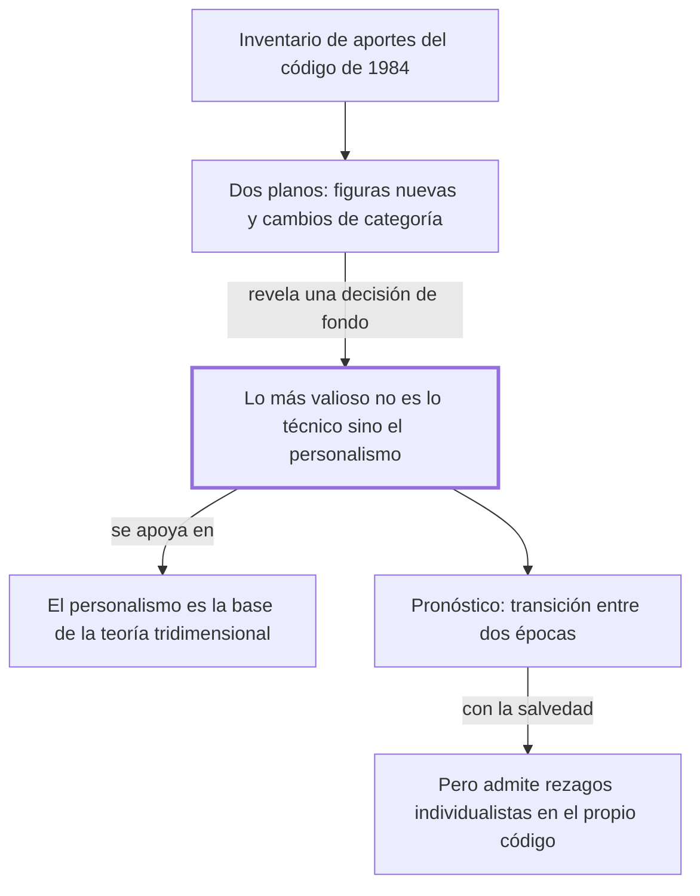

# § 66. Los significativos aportes del código civil peruano de 1984 + § 67. El personalismo del código civil 1984

## 1. Idea principal

El aporte más duradero del Código Civil peruano de 1984 no son sus figuras nuevas sino su personalismo: pone a la persona donde los códigos del siglo XIX ponían el patrimonio.

Estos dos capítulos contestan qué cambió ese código y por qué al autor le importa tanto. Es el momento en que la teoría de los capítulos anteriores deja de ser filosofía y se vuelve articulado.

## 2. Lo esencial del capítulo

El § 66 es un inventario y un anuncio: enumera los aportes del código de 1984 y avisa que los parágrafos siguientes los desarrollan (pp. 161-162). Los nombra sin explicarlos —el daño a la persona, con su especie más original, el daño al proyecto de vida; la nueva categorización del sujeto de derecho, con el concebido y la organización de personas no inscripta; el comité como persona jurídica—, y la lista completa conviene leerla en el original. Ahí se mezclan, sin que el texto lo marque, dos tipos de aporte distintos: figuras que antes no existían en el código, como el comité, y cambios de categoría, o sea reclasificar algo que ya existía en la realidad pero que el derecho no reconocía como sujeto, que es el caso de la organización de personas no inscripta, antes llamada irregular o de hecho (p. 162). El segundo tipo es el que muestra la influencia de la teoría: cambiar quién cuenta como sujeto es una decisión filosófica antes que técnica.

El § 67 reconoce esos aportes y enseguida los pone en segundo plano: "más allá de dichos aportes, lo más trascendente y valioso [...] es su inédita inspiración personalista" (pp. 162-163). Ese personalismo se define por contraste con lo que reemplaza: el intento de revertir la tendencia histórica que hacía de la tutela del individuo aisladamente considerado y del patrimonio la finalidad primordial del código. La diferencia entre "individuo aislado" y "persona" es toda la apuesta del libro. El autor participó de la redacción de ese código, dato que consigna en nota.

La afirmación más fácil de invertir al estudiarla es la que sigue: la concepción personalista "ha sido la base teórica indispensable" para concebir que el objeto de estudio del derecho es la interacción de vida humana social, valores y normas (p. 163). No es que el tridimensionalismo llevara al personalismo, sino al revés: la premisa del edificio es una idea sobre el ser humano, no un método. El cierre predice que los historiadores verán al código como producto de una transición entre una época individualista y otra personalista (p. 164), y admite que "mantiene aún algunos rezagos de una concepción extremadamente individualista y patrimonialista". Son predicciones sobre lo que dirán otros, apoyadas en "varias autorizadas voces" que no identifica.

## 3. Mapa

## 4. Vocabulario clave

- **Personalismo humanista** — la concepción que pone a la persona, y no al individuo aislado ni al patrimonio, como finalidad del derecho.
- **Daño al proyecto de vida** — el daño que frustra el plan de vida de alguien; el autor lo destaca "por su originalidad" (p. 162).
- **Concebido** — el ser humano ya concebido y aún no nacido, al que el código reconoce como sujeto de derecho.
- **Organización de personas no inscripta** — la agrupación que actúa sin estar registrada; antes se la llamaba irregular o de hecho.
- **Patrimonialismo** — la orientación que hace del patrimonio el centro de la protección jurídica.

## 5. Distinciones que se confunden

- **Persona vs. individuo aislado** — el personalismo protege a la persona en su vida concreta; el individualismo protege a un sujeto abstracto y a sus bienes.
  - Se confunden porque: en el lenguaje corriente son sinónimos, y las dos posturas dicen defender al ser humano.
  - Criterio para decidir: ¿se protege la realización de la persona, o su esfera y su patrimonio frente a los demás? Si es lo segundo, es individualismo.
  - Dónde se cae: se dice que el código es personalista porque protege derechos individuales, que es la tendencia que vino a revertir.

- **El personalismo funda la teoría vs. la teoría funda el personalismo** — el autor sostiene lo primero.
  - Se confunden porque: los dos aparecen juntos en todo el libro y se refuerzan, así que el orden parece indistinto.
  - Criterio para decidir: ¿cuál se presenta como "base teórica indispensable"? En la p. 163 es el personalismo.
  - Dónde se cae: se explica que deduce el personalismo del tridimensionalismo, invirtiendo la fundamentación que el texto afirma.

## 6. Autoevaluación

1. ¿Qué se entiende por el personalismo del Código Civil peruano de 1984? Explique a qué orientación se opone y qué relación guarda con la teoría tridimensional.
2. El autor sostiene que el código es personalista y a la vez admite que mantiene rezagos individualistas. ¿Se contradice?

--- No mires esto hasta responder ---

1. El personalismo del código de 1984 es la concepción que pone a la persona, en su vida concreta, como finalidad del ordenamiento, y no al individuo aisladamente considerado ni a su patrimonio. El autor lo considera lo más valioso del código, por encima de sus aportes técnicos: "más allá de dichos aportes, lo más trascendente y valioso [...] es su inédita inspiración personalista" (pp. 162-163). Se opone a la tendencia histórica de los códigos del siglo XIX, que hacían de la tutela del individuo aislado y del patrimonio su finalidad primordial. Con la teoría tridimensional guarda una relación de fundamento y no de consecuencia: la concepción personalista "ha sido la base teórica indispensable" para concebir el derecho como interacción de vida humana social, valores y normas (p. 163), y no al revés. El propio autor admite que el código conserva rezagos individualistas y patrimonialistas.
2. No: sostiene que la inspiración dominante es personalista y que la transición entre una época y otra está en curso, no consumada (p. 164). Discutible: sin decir cuáles son esos rezagos ni cuánto pesan, la tesis se vuelve difícil de refutar, y el pronóstico sobre lo que dirán los historiadores se apoya en "varias autorizadas voces" que no identifica.

## Flashcards

Qué es el personalismo humanista en el derecho | La concepción que pone a la persona, no al individuo aislado ni al patrimonio, como finalidad
Cuál es lo más valioso del Código Civil peruano de 1984 según el autor | Su inédita inspiración personalista, más allá de sus aportes técnicos
Qué aportes enumera el § 66 del Código de 1984 | El daño a la persona, dos nuevos sujetos de derecho y el comité como persona jurídica
Qué relación afirma entre personalismo y tridimensionalismo | El personalismo es la base teórica indispensable de la teoría tridimensional
