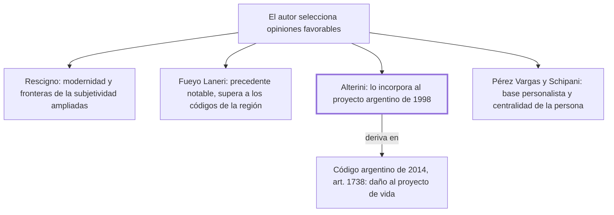

# § 68. Apreciaciones de juristas extranjeros sobre el código civil de 1984

## 1. Idea principal

Cinco civilistas de Italia, Chile, Argentina y Costa Rica reconocen los aportes del Código de 1984, y el argentino los incorporó a un proyecto que terminó en el código de su país.

Contesta si el elogio al código es solo del autor o tiene respaldo externo. Es el capítulo más citacional del libro y el que aporta la evidencia que otros capítulos dan por sentada.

## 2. Lo esencial del capítulo

El autor dice haber escogido "al azar" a algunos civilistas destacados. Conviene notar la advertencia: son opiniones favorables seleccionadas, no un balance de la recepción, así que el capítulo muestra que hubo reconocimiento pero no cuánto ni con qué objeciones.

El testimonio más desarrollado es el del italiano Pietro Rescigno, de La Sapienza. Elogia la modernidad del código por haber superado formas arcaicas de encuadrar y presentar la materia, y dice que una lectura atenta sirve para responder preguntas que se plantean en la propia doctrina italiana, incluso para un lector europeo atado a códigos más antiguos que el italiano (pp. 165-166). Señala como novedades más importantes del Libro del Derecho de las Personas dos cosas: haber extendido las fronteras de la subjetividad —incluyendo en el concepto de sujeto de derecho, además de las personas físicas y jurídicas, al concebido y a los entes de hecho— y el tratamiento de los derechos de la persona. Le llama la atención la "inusitada riqueza" del régimen de los entes de hecho, donde junto a asociaciones y comités sin personalidad aparece contemplada la fundación. Y respalda la decisión terminológica: preferir la noción de sujeto de derecho a las viejas fórmulas de personalidad y capacidad jurídica.

El chileno Fernando Fueyo Laneri considera el cambio "notable" y un magnífico precedente para futuras reformas, y sostiene que por su inspiración personalista el código supera a los latinoamericanos en esta materia; agrega que es el lugar preferente para regular los derechos de la persona de forma completa y sin limitaciones (pp. 166-167).

El caso más fuerte, porque no es una opinión sino un efecto verificable, es el argentino. Atilio Alterini integró la comisión que en 1998 preparó un proyecto de código para reemplazar al de Vélez Sarsfield de 1869, y ahí se acogió el aporte del art. 1985 peruano en la protección de la libertad fenoménica o proyecto de vida. Ese proyecto no se promulgó, pero la línea siguió: el Código Civil y Comercial de la Nación, promulgado en 2014, dispone en su art. 1738 que es indemnizable el daño que "resulte de la interferencia de su proyecto de vida" (p. 167). O sea que la figura pasó de un código a otro.

Cierran el costarricense Víctor Pérez Vargas, para quien el gran valor del código es su contribución a la integración de los pueblos "sobre una base axiológica personalista", y el italiano Sandro Schipani, que en un congreso en Lima en 1988 destacó su contribución a plasmar en disposiciones precisas el principio de la centralidad de la persona, y recordó que las XI Jornadas Argentinas de Derecho Civil de 1987 le habían reconocido un rol innovador (p. 168).

## 3. Mapa

## 4. Vocabulario clave

- **Entes de hecho** — el nombre que Rescigno le da a la organización de personas no inscripta: la que actúa sin registro.
- **Subjetividad jurídica** — la aptitud de ser sujeto de derecho; el código la extiende más allá de las personas físicas y jurídicas.
- **Capacidad jurídica** — la vieja fórmula que el código reemplaza por la noción de sujeto de derecho.
- **Codificación civil comparada** — el conjunto de los códigos civiles de distintos países tomados como término de comparación.

## 5. Distinciones que se confunden

- **Elogio doctrinal vs. recepción normativa** — cuatro de los cinco testimonios son opiniones; el argentino es un artículo vigente.
  - Se confunden porque: el capítulo los presenta seguidos y con el mismo tono celebratorio.
  - Criterio para decidir: ¿la influencia quedó en un texto de doctrina o en el articulado de un código? El art. 1738 argentino es lo segundo.
  - Dónde se cae: se usa la lista completa como prueba de influencia, cuando solo un caso muestra un efecto verificable.

- **Sujeto de derecho vs. capacidad jurídica** — Rescigno celebra que el código haya preferido la primera noción a la segunda.
  - Se confunden porque: las dos sirven para decir quién cuenta en el derecho.
  - Criterio para decidir: ¿se pregunta quién es titular, o cuánto puede actuar? La capacidad gradúa; la subjetividad admite o no.
  - Dónde se cae: se dice que el código amplió la capacidad jurídica, cuando amplió quiénes son sujetos.

## 6. Autoevaluación

1. Un compañero cita este capítulo como prueba de que el Código de 1984 influyó en la región. ¿Cuál de los cinco testimonios sostiene mejor esa afirmación y por qué?
2. El autor dice haber escogido a los juristas "al azar". ¿Qué problema tiene esa afirmación y cómo afecta a lo que el capítulo puede probar?
3. Rescigno celebra que el código prefiera "sujeto de derecho" a "personalidad y capacidad jurídica". ¿Por qué esa elección terminológica no es un detalle?
4. Un capítulo entero de elogios ajenos, en un libro escrito por uno de los redactores del código. ¿Qué función cumple y qué riesgo corre?

--- No mires esto hasta responder ---

1. El argentino. Alterini incorporó el aporte del art. 1985 al proyecto de 1998, y esa línea llegó al art. 1738 del Código Civil y Comercial promulgado en 2014, que declara indemnizable el daño a la interferencia del proyecto de vida. Es influencia con efecto normativo, no opinión (p. 167).
2. Que no puede ser al azar si todos los seleccionados son elogiosos: es una muestra sesgada por construcción. El capítulo prueba que hubo reconocimiento de juristas de peso, no que la recepción haya sido mayoritariamente favorable ni cuáles fueron las objeciones.
3. Porque cambia la pregunta. La capacidad jurídica gradúa cuánto puede actuar alguien que ya cuenta; la subjetividad decide quién cuenta. Solo con la segunda noción se puede incluir al concebido y a los entes de hecho, que es el aporte que Rescigno destaca.
4. Cumple la función de aportar la evidencia externa que el resto del libro presupone, y es legítimo porque las citas son verificables. El riesgo es de selección: al elegir solo elogios, un lector que busque la discusión real sobre el código no la encuentra acá.

## Flashcards

Qué jurista italiano de La Sapienza elogia el Código de 1984 en este capítulo | Pietro Rescigno
Qué dos novedades destaca Rescigno del Libro del Derecho de las Personas | Extender las fronteras de la subjetividad y el tratamiento de los derechos de la persona
Cómo llama Rescigno a la organización de personas no inscripta | Entes de hecho
Qué fórmulas reemplaza el código por la noción de sujeto de derecho | Personalidad y capacidad jurídica
Qué civilista chileno lo considera un magnífico precedente | Fernando Fueyo Laneri
Qué jurista argentino incorporó el aporte del art. 1985 a un proyecto de código | Atilio Alterini, en el proyecto de 1998
Qué artículo del código argentino de 2014 recoge el daño al proyecto de vida | El artículo 1738
Cómo distingo un elogio doctrinal de una recepción normativa | El elogio queda en doctrina; la recepción llega al articulado de un código
