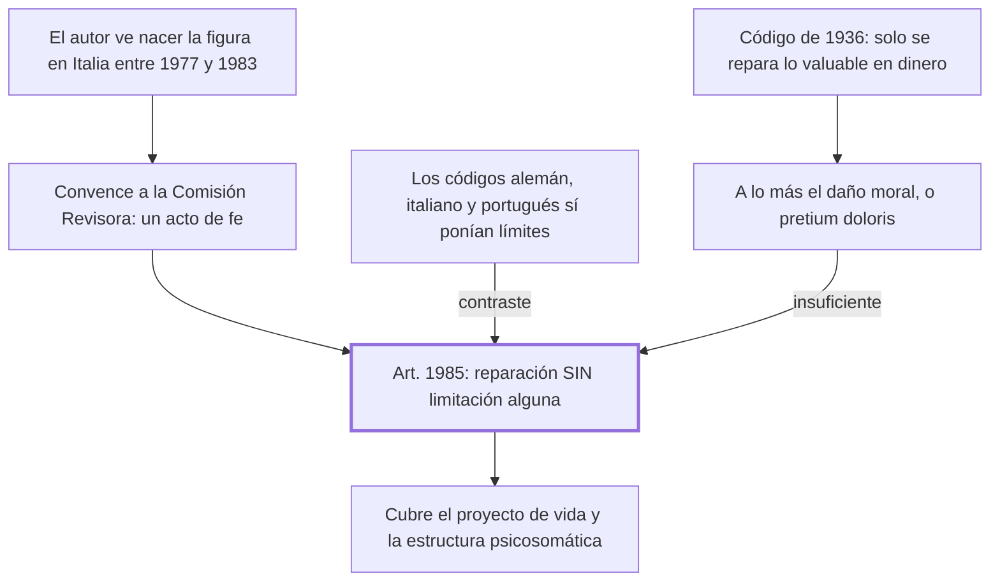

# § 69. La incorporación del daño a la persona

## 1. Idea principal

El art. 1985 del Código de 1984 fue el primero en obligar a reparar sin límite cualquier daño al ser humano, donde antes solo se indemnizaba lo que podía valuarse en dinero.

Contesta cómo el personalismo pasó de idea a artículo. Es el capítulo más concreto del libro y el único contado en primera persona, porque el autor fue quien impulsó esa incorporación.

## 2. Lo esencial del capítulo

El Código de 1936 privilegiaba la responsabilidad civil por daños a las cosas, al patrimonio: los que generan perjuicios valuables en dinero (p. 172). El daño a la persona era irrelevante para el derecho. A lo más se tenía en cuenta el "daño moral" o *pretium doloris* —el dolor, el sufrimiento—, que el autor llama designación jurídicamente exótica y que en rigor es un daño psíquico, referido a un solo aspecto del ser humano. Bajo esa concepción solo se resarcía lo que derivaba en daño emergente o lucro cesante, y quedaban sin reparación los daños a la vida, a la libertad, al honor, a la identidad, a la intimidad. La fórmula con que lo resume es la más filosa: se privilegiaba "el haber sobre el ser".

El relato personal explica de dónde salió la figura. El autor vivió e investigó en Italia entre 1977 y 1983, donde vio nacer el daño a la persona y leyó a Alpa y Busnelli, que llegaron a cambiarle el nombre por "daño biológico" y "daño a la salud" para hacerlo aplicable con las normas que tenían. Al volver convenció a la Comisión Revisora de incorporarlo, y reconoce que no fue fácil: la figura no tenía antecedentes legislativos ni había llegado a la región. Lo llama "un acto de fe". En el Congreso Internacional de Lima de 1985 lo presentó y usó por primera vez la expresión "daño al proyecto de vida", definido como el daño cuya consecuencia es la frustración del proyecto de vida de la persona (p. 171).

El aporte se mide por comparación, y ahí está el argumento más verificable. Los códigos alemán de 1900 e italiano de 1942 ya establecían el deber de resarcir consecuencias extrapatrimoniales, pero con límites estrictos: el alemán enumeraba taxativamente los casos indemnizables y el italiano supeditaba la reparación a que antes se hubiera consumado un delito; el portugués de 1967 la restringía a los casos "graves". El art. 1985 peruano, en cambio, obliga a reparar **sin limitación alguna** las consecuencias patrimoniales y extrapatrimoniales de un daño a la persona, entendida como unidad psicosomática sustentada en su libertad (pp. 172-173).

El cierre despliega qué entra en esa noción. Por un lado los daños a la libertad fenoménica, es decir al proyecto de vida, que en casos límite crean un vacío existencial capaz de llevar a la adicción o al suicidio. Por otro los daños a la estructura psicosomática —cuerpo, psique, salud—, llamados biológicos, que según su gravedad comprometen la calidad de vida: el daño al bienestar.

## 3. Mapa

## 4. Vocabulario clave

- **Daño a la persona** — la categoría genérica del art. 1985: cualquier daño al ser humano, en su estructura psicosomática o en su libertad.
- **Daño moral o pretium doloris** — el dolor o sufrimiento; para el autor es solo un daño psíquico-emocional, una parte pequeña del daño a la persona.
- **Daño emergente** — la pérdida efectivamente sufrida, lo que salió del patrimonio.
- **Lucro cesante** — la ganancia que se dejó de obtener por causa del daño.
- **Libertad fenoménica** — la libertad hecha actos concretos en el mundo; es lo que el proyecto de vida realiza y lo que su frustración daña.

## 5. Distinciones que se confunden

- **Daño moral vs. daño a la persona** — el moral es una especie mínima; el daño a la persona es el género que cubre cuerpo, psique y libertad.
  - Se confunden porque: por décadas el daño moral fue el único rótulo disponible para lo no patrimonial, así que quedó como sinónimo.
  - Criterio para decidir: ¿lo lesionado es el sufrimiento de la víctima, o alguna otra dimensión de su persona? Si es solo dolor, es daño moral.
  - Dónde se cae: se contesta que el art. 1985 amplió el daño moral, cuando creó una categoría más amplia que lo contiene.

- **Reconocer el daño extrapatrimonial vs. repararlo sin límite** — los códigos alemán, italiano y portugués hicieron lo primero; la novedad peruana es lo segundo.
  - Se confunden porque: los cuatro códigos mencionan consecuencias no patrimoniales, así que parecen equivalentes.
  - Criterio para decidir: ¿la reparación está condicionada a una lista, a un delito previo o a la gravedad? Si sí, hay límite.
  - Dónde se cae: se dice que el Código de 1984 fue el primero en admitir el daño extrapatrimonial, cuando fue el primero en no restringirlo.

## 6. Autoevaluación

1. Una persona pierde la posibilidad de ejercer su oficio por una lesión, pero conserva su patrimonio y no sufre dolor físico. ¿Habría tenido reparación bajo el Código de 1936? ¿Y bajo el art. 1985?
2. Un abogado sostiene que el Código de 1984 fue el primer código del mundo en reparar daños no patrimoniales. ¿Qué le corregirías con lo que dice este capítulo?
3. El autor cuenta su propia gestión ante la Comisión Revisora y llama "acto de fe" a la decisión. ¿Eso refuerza o debilita su argumento sobre el valor de la figura?
4. La noción de daño a la persona se define sin límites, y de ahí su ventaja. ¿Qué problema le crea eso a un juez?

--- No mires esto hasta responder ---

1. Bajo el de 1936 muy probablemente no: no hay perjuicio valuable directamente en dinero ni dolor, y solo se resarcía daño emergente o lucro cesante, más excepcionalmente el daño moral. Bajo el art. 1985 sí: es un daño a la libertad fenoménica, o sea al proyecto de vida (pp. 172-174).
2. Que los códigos alemán de 1900 e italiano de 1942 ya establecían el deber de resarcir consecuencias extrapatrimoniales. Lo primero fue reparar el daño a la persona **sin limitación alguna**, donde los otros lo ataban a una lista taxativa, a un delito previo o a la gravedad.
3. Las dos cosas. Refuerza el relato histórico, porque es testimonio directo de cómo entró la figura. Lo debilita como evaluación, porque el autor es a la vez promotor y juez del aporte, y "acto de fe" admite que se decidió sin antecedentes ni evidencia.
4. Le deja sin criterio de cuantificación: si cualquier daño al ser humano es reparable y no hay lista ni tope, hay que decidir caso por caso cuánto vale una frustración del proyecto de vida. El capítulo celebra la amplitud y no discute ese costo. Discutible: el autor diría que esa es tarea propia del juez y no del código.

## Flashcards

Qué artículo del Código Civil peruano de 1984 incorporó el daño a la persona | El artículo 1985
Qué se reparaba bajo el Código Civil de 1936 | Los daños valuables en dinero: daño emergente y lucro cesante
Qué es el pretium doloris | El daño moral: el dolor o sufrimiento de la víctima
Con qué fórmula resume el autor la concepción patrimonialista | Que privilegiaba el haber sobre el ser
Dónde y cuándo vio nacer el autor la figura del daño a la persona | En Italia, entre 1977 y 1983, con Alpa y Busnelli
Cuándo se usó por primera vez la expresión daño al proyecto de vida | En el Congreso Internacional de Lima de 1985
Qué es el daño al proyecto de vida | El daño cuya consecuencia es la frustración del proyecto de vida de la persona
Por qué el art. 1985 es distinto de los códigos alemán, italiano y portugués | Porque repara sin limitación alguna, sin lista taxativa, delito previo ni requisito de gravedad
