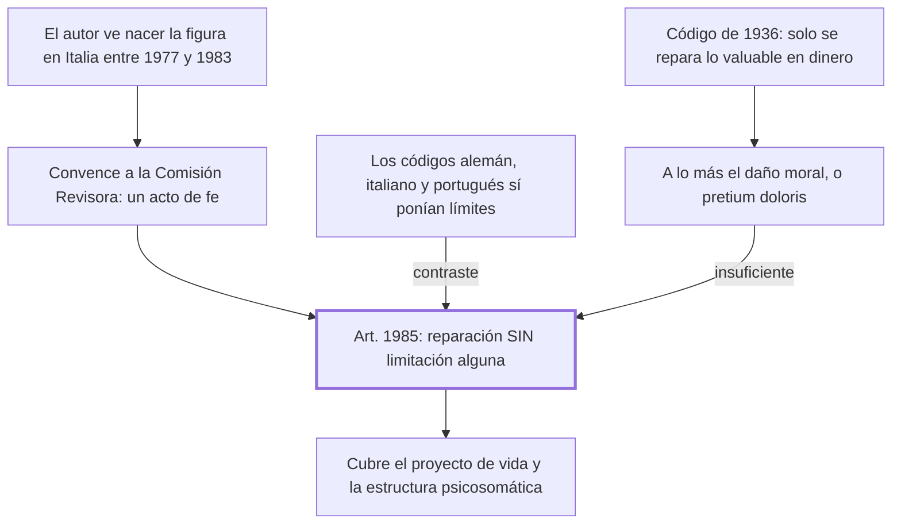

# § 69. La incorporación del daño a la persona

## 1. Idea principal

El art. 1985 del Código de 1984 fue el primero en obligar a reparar sin límite cualquier daño al ser humano, donde antes solo se indemnizaba lo que podía valuarse en dinero.

Contesta cómo el personalismo pasó de idea a artículo. Es el capítulo más concreto del libro y el único contado en primera persona, porque el autor fue quien impulsó esa incorporación.

## 2. Lo esencial del capítulo

El Código de 1936 privilegiaba la responsabilidad civil por daños al patrimonio, o sea los perjuicios valuables en dinero (p. 172); el daño a la persona era irrelevante para el derecho. A lo más se tenía en cuenta el "daño moral" o *pretium doloris* —el dolor, el sufrimiento—, designación que el autor llama jurídicamente exótica y que en rigor cubre un daño psíquico, un solo aspecto del ser humano. Bajo esa concepción solo se resarcía lo que derivaba en daño emergente o lucro cesante, y quedaban sin reparación los daños a la vida, la libertad o el honor. La fórmula con que lo resume es la más filosa: se privilegiaba "el haber sobre el ser".

El relato es en primera persona: el autor vivió e investigó en Italia entre 1977 y 1983, donde vio nacer el daño a la persona y leyó a Alpa y Busnelli, y al volver convenció a la Comisión Revisora de incorporarlo, sin antecedentes legislativos en la región. Lo llama "un acto de fe". En el Congreso Internacional de Lima de 1985 usó por primera vez la expresión "daño al proyecto de vida", definido como el daño cuya consecuencia es la frustración del proyecto de vida de la persona (p. 171).

El aporte se mide por comparación, y ahí está el argumento más verificable. Los códigos alemán de 1900 e italiano de 1942 ya establecían el deber de resarcir consecuencias extrapatrimoniales, pero con límites estrictos —una lista taxativa de casos indemnizables en el alemán, la exigencia de un delito previo en el italiano—, y el portugués de 1967 la restringía a los casos "graves". El art. 1985 peruano, en cambio, obliga a reparar **sin limitación alguna** las consecuencias patrimoniales y extrapatrimoniales de un daño a la persona, entendida como unidad psicosomática sustentada en su libertad (pp. 172-173). Esa noción cubre tanto los daños a la libertad fenoménica, o sea al proyecto de vida, como los daños biológicos a la estructura psicosomática.

## 3. Mapa

## 4. Vocabulario clave

- **Daño a la persona** — la categoría genérica del art. 1985: cualquier daño al ser humano, en su estructura psicosomática o en su libertad.
- **Daño moral o pretium doloris** — el dolor o sufrimiento; para el autor es solo un daño psíquico-emocional, una parte pequeña del daño a la persona.
- **Daño emergente** — la pérdida efectivamente sufrida, lo que salió del patrimonio.
- **Lucro cesante** — la ganancia que se dejó de obtener por causa del daño.
- **Libertad fenoménica** — la libertad hecha actos concretos en el mundo; es lo que el proyecto de vida realiza y lo que su frustración daña.

## 5. Distinciones que se confunden

- **Daño moral vs. daño a la persona** — el moral es una especie mínima; el daño a la persona es el género que cubre cuerpo, psique y libertad.
  - Se confunden porque: por décadas el daño moral fue el único rótulo disponible para lo no patrimonial, así que quedó como sinónimo.
  - Criterio para decidir: ¿lo lesionado es el sufrimiento de la víctima, o alguna otra dimensión de su persona? Si es solo dolor, es daño moral.
  - Dónde se cae: se contesta que el art. 1985 amplió el daño moral, cuando creó una categoría más amplia que lo contiene.

- **Reconocer el daño extrapatrimonial vs. repararlo sin límite** — los códigos alemán, italiano y portugués hicieron lo primero; la novedad peruana es lo segundo.
  - Se confunden porque: los cuatro códigos mencionan consecuencias no patrimoniales, así que parecen equivalentes.
  - Criterio para decidir: ¿la reparación está condicionada a una lista, a un delito previo o a la gravedad? Si sí, hay límite.
  - Dónde se cae: se dice que el Código de 1984 fue el primero en admitir el daño extrapatrimonial, cuando fue el primero en no restringirlo.

## 6. Autoevaluación

1. ¿Qué se entiende por daño a la persona? Explique en qué se distingue del daño moral y cuáles son las implicaciones de repararlo sin limitación alguna.
2. Una persona pierde la posibilidad de ejercer su oficio por una lesión, pero conserva su patrimonio y no sufre dolor físico. ¿Habría tenido reparación bajo el Código de 1936? ¿Y bajo el art. 1985?

--- No mires esto hasta responder ---

1. El daño a la persona es la categoría genérica que incorpora el art. 1985 del Código Civil peruano de 1984: cualquier daño al ser humano entendido como unidad psicosomática sustentada en su libertad, tanto en su estructura psicosomática —cuerpo, psique, salud— como en su libertad fenoménica, o sea su proyecto de vida (pp. 172-173). Se distingue del daño moral o *pretium doloris* porque este es solo el dolor o sufrimiento, un daño psíquico referido a un aspecto del ser humano, y era el único rótulo no patrimonial disponible bajo el Código de 1936, que privilegiaba "el haber sobre el ser" (p. 172). La implicación central es que la reparación no queda condicionada: donde el código alemán de 1900 enumeraba taxativamente los casos, el italiano de 1942 exigía un delito previo y el portugués de 1967 pedía gravedad, el art. 1985 obliga a reparar sin limitación alguna las consecuencias patrimoniales y extrapatrimoniales. La contrapartida es que deja al juez sin criterio de cuantificación, cosa que el capítulo no discute.
2. Bajo el de 1936 muy probablemente no: no hay perjuicio valuable directamente en dinero ni dolor, y solo se resarcía daño emergente o lucro cesante, más excepcionalmente el daño moral. Bajo el art. 1985 sí: es un daño a la libertad fenoménica, o sea al proyecto de vida, y se repara sin limitación alguna (pp. 172-174).

## Flashcards

Qué es el daño a la persona en el art. 1985 del Código peruano de 1984 | Cualquier daño al ser humano, en su estructura psicosomática o en su libertad
Qué es el daño al proyecto de vida | El daño cuya consecuencia es la frustración del proyecto de vida de la persona
Por qué el art. 1985 es distinto de los códigos alemán, italiano y portugués | Porque repara sin limitación alguna, sin lista taxativa, delito previo ni requisito de gravedad
Cómo distingo el daño moral del daño a la persona | El moral es solo el dolor o sufrimiento; el daño a la persona es el género que cubre cuerpo, psique y libertad
