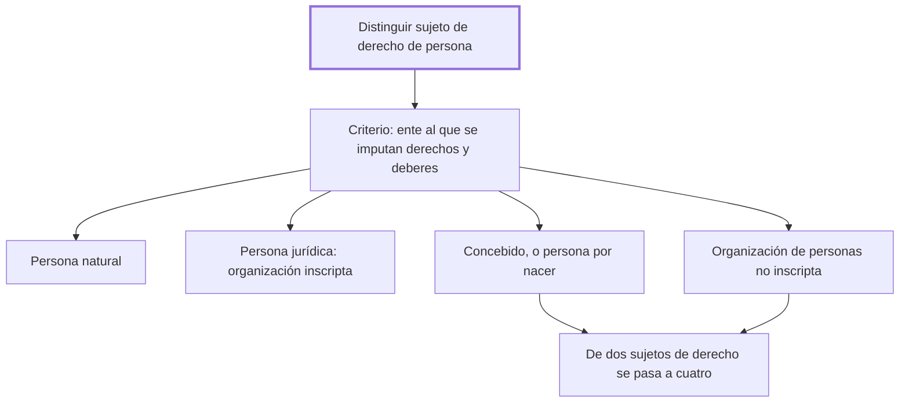

# § 70. La nueva categorización del sujeto de derecho

## 1. Idea principal

Distinguir "sujeto de derecho" de "persona" permitió pasar de dos a cuatro sujetos, sumando al concebido y a la organización de personas no inscripta.

Contesta cómo una distinción técnica abre la puerta a proteger a quienes el derecho antes no veía. Es el capítulo más corto del libro y el que hace de gozne entre los dos que lo rodean.

## 2. Lo esencial del capítulo

El aporte que el capítulo destaca es haber puesto el énfasis en la noción de sujeto de derecho, distinguiéndola del concepto de persona. Y el autor califica esa diferencia de manera precisa: es "de carácter eminentemente técnico" (p. 175). No es una tesis filosófica sino una herramienta, y su función es la que dice a continuación: facilitar que en el código se incorpore y se regule una categorización nueva.

Lo que esa distinción habilita es concreto. Junto a las tradicionales personas naturales y jurídicas —siendo la persona jurídica una organización de personas inscripta— entran como sujetos de derecho dos entes más: el concebido, o persona por nacer, y la organización de personas **no** inscripta. El criterio que los agrupa a los cuatro es el mismo: son entes a los que se imputan derechos y deberes, es decir situaciones jurídicas subjetivas.

El argumento que justifica incluir a los dos nuevos es de correspondencia con la realidad, y es breve. Los dos actúan efectivamente en la realidad, directamente o por medio de sus representantes, aunque no hayan recibido inscripción. O sea que el derecho venía ignorando a entes que ya operaban, y la solución "se ajusta a la realidad de la vida" (p. 176). Conviene notar que el paso decisivo está en separar la titularidad del reconocimiento formal: sujeto de derecho se es por actuar y por serle imputables derechos, no por estar registrado ni por haber nacido.

El resultado se enuncia como un número: donde antes se reconocían dos sujetos de derecho, ahora se reconocen cuatro. El capítulo no desarrolla ninguno de los dos nuevos —eso lo hacen los parágrafos que siguen— así que su función es la de bisagra: instala la categoría que después se llena.

## 3. Mapa

## 4. Vocabulario clave

- **Situaciones jurídicas subjetivas** — los derechos y deberes que se imputan a un ente; tenerlos atribuibles es lo que lo vuelve sujeto de derecho.
- **Nasciturus** — el ya concebido y todavía no nacido; el código lo llama también persona por nacer.
- **Persona natural** — el ser humano ya nacido, uno de los cuatro sujetos de derecho del código.

## 5. Distinciones que se confunden

- **Sujeto de derecho vs. persona** — el primero es el género y el segundo una de sus especies; sin separarlos no entran el concebido ni la organización no inscripta.
  - Se confunden porque: en el uso corriente y en los códigos anteriores eran lo mismo, y todavía se usan como sinónimos.
  - Criterio para decidir: ¿se le pueden imputar derechos y deberes? Con eso alcanza para ser sujeto; ser persona exige además haber nacido o estar inscripto.
  - Dónde se cae: se dice que el código reconoció al concebido como persona, cuando lo reconoció como sujeto de derecho, que es la categoría más amplia.

- **Organización inscripta vs. no inscripta** — la primera es la persona jurídica clásica; la segunda actúa igual sin registro y ahora también es sujeto.
  - Se confunden porque: las dos son agrupaciones de personas con un fin común y las dos actúan en la realidad.
  - Criterio para decidir: ¿completó la inscripción? Solo eso las separa, y ya no decide si es sujeto de derecho.
  - Dónde se cae: se responde que sin inscripción no hay sujeto de derecho, que es exactamente lo que este capítulo vino a corregir.

## 6. Autoevaluación

1. Un grupo de vecinos recauda fondos y contrata servicios sin haberse inscripto nunca. Bajo la categorización del código, ¿qué es y por qué?
2. Un compañero afirma que el código de 1984 declaró persona al concebido. ¿Qué le corregirías?
3. El autor llama a la distinción "eminentemente técnica". ¿Por qué le conviene presentarla así y no como una tesis filosófica?
4. El capítulo justifica la ampliación diciendo que esos entes ya actúan en la realidad. ¿Alcanza ese argumento?

--- No mires esto hasta responder ---

1. Es una organización de personas no inscripta, y por lo tanto sujeto de derecho: se le imputan derechos y deberes y actúa en la realidad, directamente o por representantes, aunque no tenga registro (pp. 175-176).
2. Que lo reconoció como sujeto de derecho, no como persona. Es la categoría más amplia, y justamente la distinción entre las dos es lo que permitió incluirlo sin tener que declararlo nacido.
3. Porque una herramienta técnica no obliga a discutir de nuevo la filosofía: se justifica por lo que permite hacer. Presentarla así le deja el debate de fondo a los capítulos sobre el personalismo y vuelve la ampliación una cuestión de buena técnica legislativa.
4. Es un buen argumento contra el formalismo, porque muestra un desajuste entre el derecho y los hechos. Pero no alcanza por sí solo: hay muchos entes que actúan y no son sujetos de derecho, así que hace falta además la valoración de que a estos conviene protegerlos. Esa parte está en los capítulos sobre el personalismo, no acá.

## Flashcards

Cuántos sujetos de derecho reconoce el Código Civil peruano de 1984 | Cuatro, en vez de dos
Cuáles son los cuatro sujetos de derecho del código | Persona natural, persona jurídica, concebido y organización de personas no inscripta
De qué carácter es la distinción entre sujeto de derecho y persona, según el autor | Eminentemente técnico
Qué son las situaciones jurídicas subjetivas | Los derechos y deberes que se imputan a un ente
Qué es el nasciturus | El ya concebido y todavía no nacido, la persona por nacer
Qué separa a la organización inscripta de la no inscripta | Solo la inscripción; las dos actúan y las dos son sujetos de derecho
Cómo distingo sujeto de derecho de persona | Sujeto es el género: basta que se le imputen derechos y deberes
Con qué argumento se justifica incluir a los dos nuevos sujetos | Que ya actúan en la realidad, directamente o por medio de representantes
