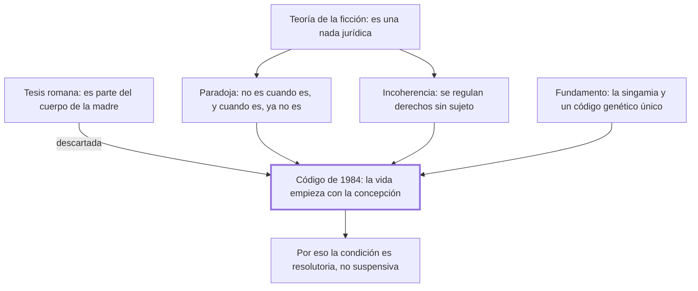

# § 71. El concebido como sujeto de derecho

## 1. Idea principal

El Código de 1984 fue el primero en decir que la vida humana empieza con la concepción y que el concebido es sujeto de derecho, y no una ficción cuyos derechos esperan el nacimiento.

Contesta qué es jurídicamente el ser ya concebido y no nacido. Es el capítulo donde el autor discute más directamente con sus críticos, porque de una palabra del artículo depende toda la construcción.

## 2. Lo esencial del capítulo

Cuando en 1965 empezó el proyecto del código había dos concepciones. La primera, de raíz romana, negaba que el concebido fuera sujeto de derecho: lo tenía por una parte del cuerpo de la mujer, "como el páncreas o la vesícula", sin autonomía (p. 177). El autor la descarta con el estado actual del conocimiento: es un nuevo ser humano en su primera etapa, autónomo e independiente de la madre.

La segunda es la teoría de la ficción, y contra ella va casi todo el capítulo. Sostiene que el concebido es una nada jurídica y que la vida empieza con el nacimiento; los derechos que se le reservan quedan en suspenso hasta que nazca vivo. El autor le señala una paradoja con una frase que usa en clase: "el concebido no es cuando es y, cuando se considera que es, ya no es" (p. 178). Y le imputa una incoherencia: los mismos ordenamientos que lo tienen por inexistente regulan su representación y sancionan el aborto, con lo que quedan derechos sin sujeto. Ya en Roma se suspendía la ejecución de una condenada gestante. Esa teoría acogieron la Constitución de 1979 —"al que está por nacer se le considera nacido para todo lo que le favorece"— y el Código de 1936.

El Código de 1984 se aparta en solitario: en su artículo primero, sin antecedentes en la codificación comparada, dice que el concebido es sujeto de derecho y que la vida humana comienza con la concepción (p. 181). El fundamento biológico es la singamia, el instante en que terminan de fusionarse los núcleos del óvulo y el espermatozoide; desde ahí hay un código genético propio, único e irrepetible, y un proceso de vida continuo hasta la muerte. De ahí la fórmula: todos los seres humanos son iguales, pero no hay dos idénticos, y en eso reside su dignidad.

El tramo decisivo es de técnica jurídica. El artículo dice que los derechos personales le son inherentes y los patrimoniales están condicionados a que nazca vivo, y ahí está la discusión: **esa condición es resolutoria, no suspensiva**. El razonamiento es que sujeto de derecho es, por definición, aquel a quien se atribuyen derechos y deberes; si los suyos estuvieran en suspenso esperando el nacimiento no tendría ninguno, dejaría de ser sujeto de derecho y volvería a ser una ficción. El autor aclara que al redactar pensó en la resolutoria "y no en la suspensiva, como algunos autores equivocadamente suponen" (pp. 183-184), y desde 1991 propone dos correcciones: quitar "en todo lo que le favorece" y quitar la palabra "condición", que es la que genera la confusión.

## 3. Mapa

## 4. Qué releer del original

1. (pp. 183-184) "La condición a la que se refiere la citada expresión es, por tanto, la condición 'resolutoria'" — es la bisagra técnica del capítulo y donde el autor responde a sus críticos; la formulación exacta importa.
2. (p. 182) El texto del artículo primero del Código de 1984 — conviene leerlo literal, porque toda la discusión gira sobre dos expresiones suyas.
3. (p. 182) La explicación de la singamia y del código genético — es el fundamento científico que solo resumí, y es lo que sostiene la fecha de inicio de la vida.

## 5. Vocabulario clave

- **Teoría de la ficción** — la que sostiene que el concebido es una nada jurídica y que sus derechos quedan en suspenso hasta el nacimiento.
- **Singamia** — el instante en que culmina la fusión de los núcleos del óvulo y el espermatozoide; para el autor, el comienzo de la vida.
- **Cigoto** — la primera célula que resulta de esa fusión, con la que empieza el proceso de vida.
- **Condición resolutoria** — la que hace cesar un derecho que ya se tiene si ocurre el hecho previsto.
- **Condición suspensiva** — la que impide que el derecho nazca hasta que ocurra el hecho previsto.

## 6. Distinciones que se confunden

- **Condición resolutoria vs. suspensiva** — la resolutoria extingue un derecho actual; la suspensiva impide que nazca hasta que ocurra el hecho.
  - Se confunden porque: las dos aparecen en el mismo artículo atadas a "que nazca vivo", y el texto no dice cuál es.
  - Criterio para decidir: ¿el titular tiene el derecho ahora? Si lo tiene y puede perderlo, es resolutoria; si no lo tiene todavía, es suspensiva.
  - Dónde se cae: se explica que los derechos del concebido están en suspenso hasta el nacimiento, que es la lectura que el autor califica de equivocada y que reintroduce la ficción.

- **Ser considerado nacido vs. ser sujeto de derecho** — la Constitución de 1979 hacía lo primero; el Código de 1984 hace lo segundo.
  - Se confunden porque: las dos fórmulas parecen proteger al concebido y las dos suenan generosas.
  - Criterio para decidir: ¿se le atribuye titularidad actual, o se lo trata *como si* fuera otra cosa? "Considerado nacido" es una ficción que sigue negando su existencia.
  - Dónde se cae: se cita la Constitución de 1979 como antecedente del artículo primero, cuando el autor la pone del lado de la teoría de la ficción.

## 7. Autoevaluación

1. Un ordenamiento tiene al concebido por una ficción y a la vez castiga el aborto y le nombra representante. Según el autor, ¿qué problema tiene esa combinación?
2. Un profesor enseña que los derechos del concebido están en suspenso hasta que nazca vivo. ¿Por qué el autor diría que eso destruye la categoría de sujeto de derecho?
3. El autor propone quitar del artículo primero la palabra "condición" y la expresión "en todo lo que le favorece". ¿Qué revela que el propio redactor pida corregirlo?
4. El fundamento del inicio de la vida es la singamia, un hecho biológico. ¿Alcanza un dato biológico para resolver una cuestión jurídica?

--- No mires esto hasta responder ---

1. Que quedan derechos sin sujeto: se regula la representación y se sanciona el aborto de un ente declarado inexistente. El autor rastrea la incoherencia hasta Roma (pp. 178-179).
2. Porque sujeto de derecho es, por definición, el ente al que se atribuyen derechos y deberes. Si todos sus derechos están en suspenso, no tiene ninguno, y entonces no es sujeto de derecho: vuelve a ser la ficción que el código quiso abandonar (pp. 183-184).
3. Que el texto se escribió sin modelo previo y quedó ambiguo en el punto decisivo. El autor lo admite: es producto de la creatividad de sus redactores y por eso mejorable. Es honesto, y a la vez debilita al artículo como pieza técnica.
4. No por sí solo: la singamia dice cuándo empieza un proceso biológico continuo con código genético propio, pero decidir que desde ahí hay un sujeto de derecho es una valoración. El capítulo trata el dato como si zanjara la cuestión. Discutible: el autor podría responder que la valoración ya está en el personalismo, y que el dato solo fija la fecha.

## Flashcards

Qué sostenía la tesis de raíz romana sobre el concebido | Que era parte del cuerpo de la mujer, sin autonomía ni independencia
Qué sostiene la teoría de la ficción sobre el concebido | Que es una nada jurídica y que sus derechos quedan en suspenso hasta el nacimiento
Con qué frase resume el autor la paradoja de la ficción | El concebido no es cuando es y, cuando se considera que es, ya no es
Qué incoherencia le imputa a la teoría de la ficción | Que regula la representación y castiga el aborto de un ente que declara inexistente
Qué dice el artículo primero del Código Civil peruano de 1984 | Que la vida humana comienza con la concepción y que el concebido es sujeto de derecho
Qué es la singamia | El instante en que culmina la fusión de los núcleos del óvulo y el espermatozoide
Cómo distingo condición resolutoria de suspensiva | La resolutoria extingue un derecho que ya se tiene; la suspensiva impide que nazca
Por qué la condición del artículo primero es resolutoria | Porque si los derechos estuvieran en suspenso el concebido no sería sujeto de derecho
