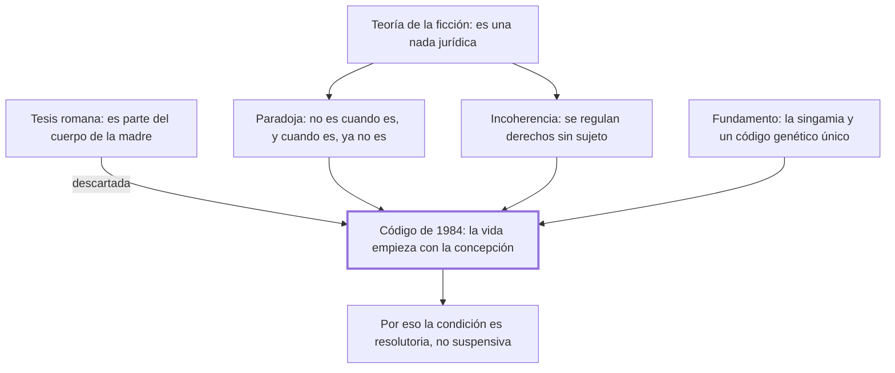

# § 71. El concebido como sujeto de derecho

## 1. Idea principal

El Código de 1984 fue el primero en decir que la vida humana empieza con la concepción y que el concebido es sujeto de derecho, y no una ficción cuyos derechos esperan el nacimiento.

Contesta qué es jurídicamente el ser ya concebido y no nacido. Es el capítulo donde el autor discute más directamente con sus críticos, porque de una palabra del artículo depende toda la construcción.

## 2. Lo esencial del capítulo

Cuando en 1965 empezó el proyecto del código había dos concepciones. La primera, de raíz romana, tenía al concebido por una parte del cuerpo de la mujer, "como el páncreas o la vesícula", sin autonomía (p. 177), y el autor la descarta con el estado actual del conocimiento: es un nuevo ser humano en su primera etapa, independiente de la madre. La segunda es la teoría de la ficción, que ocupa casi todo el capítulo: el concebido es una nada jurídica, la vida empieza con el nacimiento y sus derechos quedan en suspenso hasta que nazca vivo. La acogieron la Constitución de 1979 y el Código de 1936.

Contra ella van dos objeciones. Una paradoja: "el concebido no es cuando es y, cuando se considera que es, ya no es" (p. 178). Y una incoherencia: los ordenamientos que lo tienen por inexistente regulan su representación y sancionan el aborto, con lo que quedan derechos sin sujeto. El Código de 1984 se aparta en solitario: su artículo primero, sin antecedentes en la codificación comparada, dice que la vida humana comienza con la concepción y que el concebido es sujeto de derecho, con fundamento biológico en la singamia (p. 181).

El tramo decisivo es de técnica jurídica. El artículo condiciona los derechos patrimoniales a que nazca vivo, y ahí está la discusión: **esa condición es resolutoria, no suspensiva**. Sujeto de derecho es, por definición, aquel a quien se atribuyen derechos y deberes, y si los suyos estuvieran en suspenso no tendría ninguno, dejaría de ser sujeto y volvería a ser una ficción. El autor aclara que al redactar pensó en la resolutoria "y no en la suspensiva, como algunos autores equivocadamente suponen" (pp. 183-184), y desde 1991 propone quitar del texto "en todo lo que le favorece" y la palabra "condición", que genera la confusión.

## 3. Mapa

## 4. Vocabulario clave

- **Teoría de la ficción** — la que sostiene que el concebido es una nada jurídica y que sus derechos quedan en suspenso hasta el nacimiento.
- **Singamia** — el instante en que culmina la fusión de los núcleos del óvulo y el espermatozoide; para el autor, el comienzo de la vida.
- **Cigoto** — la primera célula que resulta de esa fusión, con la que empieza el proceso de vida.
- **Condición resolutoria** — la que hace cesar un derecho que ya se tiene si ocurre el hecho previsto.
- **Condición suspensiva** — la que impide que el derecho nazca hasta que ocurra el hecho previsto.

## 5. Distinciones que se confunden

- **Condición resolutoria vs. suspensiva** — la resolutoria extingue un derecho actual; la suspensiva impide que nazca hasta que ocurra el hecho.
  - Se confunden porque: las dos aparecen en el mismo artículo atadas a "que nazca vivo", y el texto no dice cuál es.
  - Criterio para decidir: ¿el titular tiene el derecho ahora? Si lo tiene y puede perderlo, es resolutoria; si no lo tiene todavía, es suspensiva.
  - Dónde se cae: se explica que los derechos del concebido están en suspenso hasta el nacimiento, que es la lectura que el autor califica de equivocada y que reintroduce la ficción.

- **Ser considerado nacido vs. ser sujeto de derecho** — la Constitución de 1979 hacía lo primero; el Código de 1984 hace lo segundo.
  - Se confunden porque: las dos fórmulas parecen proteger al concebido y las dos suenan generosas.
  - Criterio para decidir: ¿se le atribuye titularidad actual, o se lo trata *como si* fuera otra cosa? "Considerado nacido" es una ficción que sigue negando su existencia.
  - Dónde se cae: se cita la Constitución de 1979 como antecedente del artículo primero, cuando el autor la pone del lado de la teoría de la ficción.

## 6. Autoevaluación

1. ¿Qué se entiende por el concebido como sujeto de derecho? Explique la posición del Código Civil peruano de 1984 y sus implicaciones frente a la teoría de la ficción.
2. El fundamento del inicio de la vida es la singamia, un hecho biológico. ¿Alcanza un dato biológico para resolver una cuestión jurídica?

--- No mires esto hasta responder ---

1. El concebido es sujeto de derecho: el artículo primero del Código peruano de 1984, sin antecedentes en la codificación comparada, declara que la vida humana comienza con la concepción y que el concebido es sujeto de derecho, con fundamento biológico en la singamia y en el código genético propio, único e irrepetible, que existe desde ese instante (p. 181). Se opone a la teoría de la ficción, que lo tiene por una nada jurídica y deja sus derechos en suspenso hasta el nacimiento, y que el autor rechaza por una paradoja —"el concebido no es cuando es y, cuando se considera que es, ya no es"— y por una incoherencia, porque los ordenamientos que lo declaran inexistente regulan su representación y sancionan el aborto, dejando derechos sin sujeto (p. 178). La implicación técnica decisiva es que la condición de nacer vivo que el artículo pone a los derechos patrimoniales es resolutoria y no suspensiva: si estuvieran en suspenso el concebido no tendría ningún derecho y dejaría de ser sujeto (pp. 183-184). Por eso el propio autor propone desde 1991 quitar del artículo la palabra "condición" y la expresión "en todo lo que le favorece".
2. No por sí solo: la singamia dice cuándo empieza un proceso biológico continuo con código genético propio, pero decidir que desde ahí hay un sujeto de derecho es una valoración, y el capítulo trata el dato como si zanjara la cuestión. Discutible: el autor podría responder que la valoración ya está en el personalismo, y que el dato solo fija la fecha.

## Flashcards

Qué dice el artículo primero del Código Civil peruano de 1984 | Que la vida humana comienza con la concepción y que el concebido es sujeto de derecho
Qué sostiene la teoría de la ficción sobre el concebido | Que es una nada jurídica y que sus derechos quedan en suspenso hasta el nacimiento
Por qué la condición del artículo primero es resolutoria y no suspensiva | Porque si los derechos estuvieran en suspenso el concebido no tendría ninguno y no sería sujeto de derecho
Cómo distingo condición resolutoria de suspensiva | La resolutoria extingue un derecho que ya se tiene; la suspensiva impide que nazca
