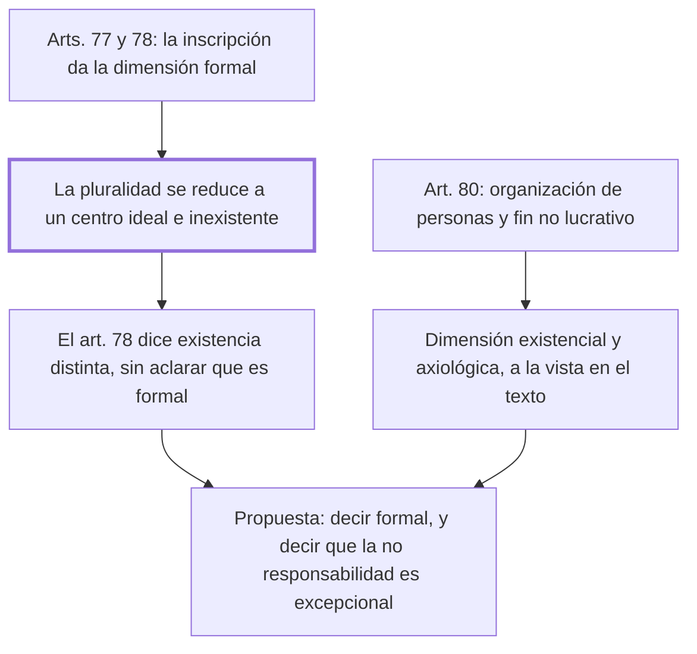

# § 72. Visión tridimensional de la persona jurídica

## 1. Idea principal

El propio articulado del código muestra las tres dimensiones de la persona jurídica, y su "existencia distinta" de los miembros es puramente formal: sin personas humanas no hay sujeto de derecho.

Contesta si el tridimensionalismo es filosofía o se puede leer en la ley. Y es donde el autor critica una redacción del código que él mismo ayudó a preparar.

## 2. Lo esencial del capítulo

El argumento es de lectura del articulado, y por eso es el más verificable del libro. El art. 80 describe a la asociación como una "organización estable de personas, naturales o jurídicas, o de ambas, que a través de una actividad común persigue un fin no lucrativo" (p. 184). Ahí están dos dimensiones a la vista: la sociológico-existencial en "organización de personas", y la axiológica en el fin no lucrativo que esos seres humanos determinan como valioso. Lo mismo ocurre en los arts. 99, 111 y 134, que regulan la fundación, el comité y las comunidades campesinas y nativas: en los cuatro casos se habla de organizaciones de personas que persiguen fines valiosos.

La tercera dimensión, la formal, está en los arts. 77 y 78 para todas las personas jurídicas. Según el primero, la persona jurídica adquiere esa dimensión al inscribirse en el registro, y lo que ocurre en ese instante el autor lo describe como una abstracción: la pluralidad de seres humanos que vivencian valores se reduce a un centro ideal y unitario —por lo tanto inexistente en la realidad— al que se le atribuyen los derechos y deberes que contraen los representantes. Ese ente ideal se conoce por el nombre que figura en el registro, así que "la persona jurídica termina siendo una simple expresión lingüística" (p. 185).

De ahí sale la crítica. El art. 78 dice que "la persona jurídica tiene existencia distinta de sus miembros", y por eso ninguno de ellos tiene derecho a su patrimonio ni está obligado por sus deudas. El autor sostiene que esa existencia es **puramente formal** —un centro unitario e ideal de imputación, "un extraño sujeto de derecho sin personas humanas"— y que el artículo debió decirlo expresamente. Es una propuesta que hizo cuando se elaboraba el código y que no prosperó. Su razón no es estética: si no se aclara, se puede terminar creyendo que existe un sujeto sin las personas que lo constituyen, cuando "sin personas humanas no existen sujetos de derecho".

La segunda corrección que propone es sobre el efecto práctico de la inscripción. Le parece que el ordenamiento debería dejar constancia expresa de que, por el simple hecho de inscribirse, a los miembros se les atribuye **de manera excepcional** el derecho a no responder personalmente por obligaciones que normalmente estarían a su cargo, y que de ellas responde un ente ideal conocido por una expresión lingüística. Conviene notar el adverbio: presentar la limitación de responsabilidad como una excepción, y no como una consecuencia natural de la personalidad jurídica, es una toma de posición sobre a quién protege el registro.

## 3. Mapa

## 4. Qué releer del original

1. (p. 184) El texto del art. 80 — es la prueba del capítulo: las dos primeras dimensiones se leen literalmente en la definición legal de asociación.
2. (p. 185) "la persona jurídica termina siendo una simple expresión lingüística" — es la formulación más fuerte del capítulo y conviene tenerla textual.
3. (pp. 185-186) Las dos correcciones que el autor propone al art. 78 — son la única parte del libro donde critica el articulado que ayudó a preparar.

## 5. Vocabulario clave

- **Centro ideal y unitario de imputación** — el punto al que se atribuyen los derechos y deberes de la organización; no existe en la realidad, solo en el registro.
- **Existencia formal** — la que la persona jurídica adquiere al inscribirse, distinta de la existencia real de sus miembros.
- **Asociación** — organización estable de personas que mediante una actividad común persigue un fin no lucrativo (art. 80).
- **Fundación** — la persona jurídica regulada en el art. 99, junto al comité y las comunidades campesinas y nativas.

## 6. Distinciones que se confunden

- **Existencia distinta vs. existencia real** — la persona jurídica existe formalmente, no como un ente separado de las personas que la componen.
  - Se confunden porque: el art. 78 dice "existencia distinta" sin agregar de qué tipo, que es justamente lo que el autor le reprocha.
  - Criterio para decidir: ¿hay alguien actuando y decidiendo? Siempre son personas humanas; el ente ideal solo recibe la imputación.
  - Dónde se cae: se concibe a la persona jurídica como un sujeto que existe por sí mismo, y el autor lo llama un absurdo: sin personas humanas no hay sujeto de derecho.

- **La inscripción crea el sujeto vs. le da la dimensión formal** — antes de inscribirse la organización ya existe y actúa.
  - Se confunden porque: el art. 77 ata la personalidad al registro, así que parece que ahí nace todo.
  - Criterio para decidir: ¿qué había antes del registro? Una organización de personas con fines valiosos, o sea dos de las tres dimensiones.
  - Dónde se cae: se contesta que sin inscripción no hay nada jurídicamente relevante, cuando el propio código reconoce a la organización no inscripta.

## 7. Autoevaluación

1. Un acreedor no puede cobrarle a los socios de una asociación inscripta. Según el capítulo, ¿de qué depende esa protección y cómo debería presentarla el código?
2. Un compañero sostiene que la persona jurídica es un sujeto de derecho que existe con independencia de sus miembros. ¿Qué le respondería el autor?
3. El autor propuso una corrección al art. 78 mientras se elaboraba el código y no prosperó. ¿Qué agrega ese dato al capítulo?
4. ¿Por qué le conviene al autor demostrar la tridimensionalidad leyendo artículos, en vez de argumentarla filosóficamente?

--- No mires esto hasta responder ---

1. Depende del simple hecho de la inscripción en el registro, que constituye un centro ideal al que se imputan las obligaciones. El autor sostiene que el código debería decir expresamente que esa no responsabilidad personal es **excepcional**, y no una consecuencia natural (pp. 185-186).
2. Que confunde una existencia formal con una real. El centro de imputación es ideal, o sea inexistente en la realidad, y quienes actúan y deciden son siempre personas humanas: "sin personas humanas no existen sujetos de derecho" (p. 186).
3. Muestra que la crítica no es retrospectiva sino que se planteó a tiempo, lo que la vuelve más creíble. Y de paso relativiza la autoridad del código: ni siquiera sus redactores acordaron en un punto que el autor considera importante.
4. Porque así la tesis deja de depender de aceptar su filosofía. Si las tres dimensiones se leen en la definición legal de asociación, el tridimensionalismo aparece como descripción de lo que el legislador ya hizo, no como una teoría que hay que adoptar antes. Discutible: los artículos se escribieron con esa teoría a la vista, así que el argumento se apoya en parte en sí mismo.

## Flashcards

Qué dos dimensiones aparecen en el art. 80 del Código Civil peruano | La sociológico-existencial en organización de personas, y la axiológica en el fin no lucrativo
Qué artículos dan la dimensión formal a las personas jurídicas | Los arts. 77 y 78
Cuándo adquiere la persona jurídica su dimensión formal | En el momento de su inscripción en el registro público
En qué se convierte la persona jurídica según la frase más fuerte del capítulo | En una simple expresión lingüística
Qué dice el art. 78 sobre la persona jurídica | Que tiene existencia distinta de sus miembros
Qué le reprocha el autor al art. 78 | No aclarar que esa existencia distinta es puramente formal
Qué propone el autor sobre la no responsabilidad de los miembros | Que el código diga expresamente que es excepcional, y no una consecuencia natural
Por qué no puede haber persona jurídica sin personas humanas | Porque son ellas las que actúan y deciden; sin ellas no hay sujeto de derecho
