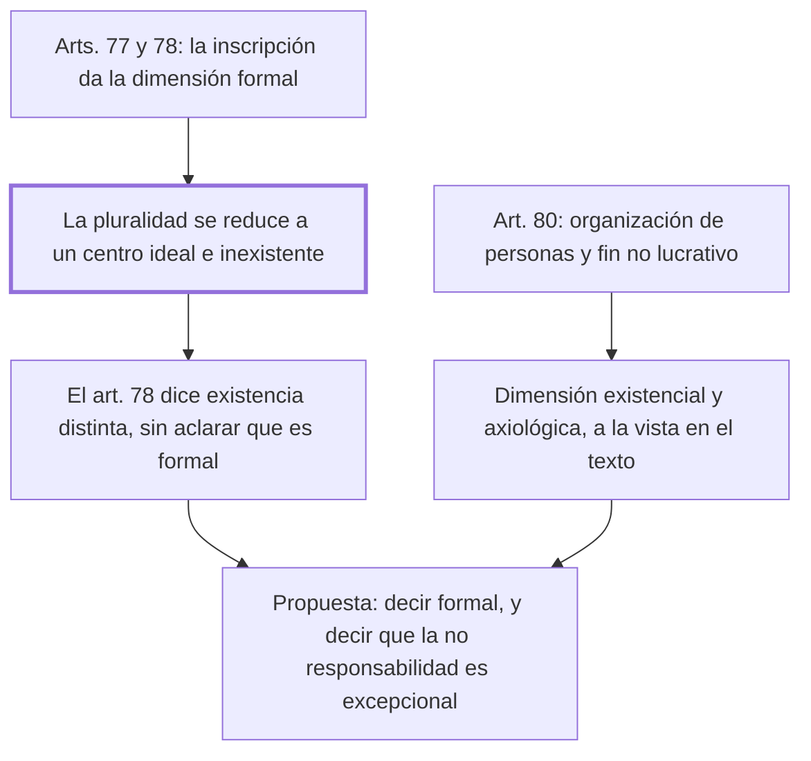

# § 72. Visión tridimensional de la persona jurídica

## 1. Idea principal

El propio articulado del código muestra las tres dimensiones de la persona jurídica, y su "existencia distinta" de los miembros es puramente formal: sin personas humanas no hay sujeto de derecho.

Contesta si el tridimensionalismo es filosofía o se puede leer en la ley. Y es donde el autor critica una redacción del código que él mismo ayudó a preparar.

## 2. Lo esencial del capítulo

El argumento es de lectura del articulado, y por eso es el más verificable del libro. El art. 80 describe a la asociación como una "organización estable de personas [...] que persigue un fin no lucrativo" (p. 184): ahí están dos dimensiones a la vista, la sociológico-existencial en "organización de personas" y la axiológica en el fin no lucrativo que esos seres humanos determinan como valioso. Lo mismo ocurre con la fundación, el comité y las comunidades campesinas y nativas, en los arts. 99, 111 y 134. La tercera dimensión, la formal, está en los arts. 77 y 78: se adquiere al inscribirse en el registro, y en ese instante la pluralidad de seres humanos que vivencian valores se reduce a un centro ideal y unitario, inexistente en la realidad, al que se atribuyen los derechos y deberes que contraen los representantes. Como ese ente se conoce por el nombre registrado, "la persona jurídica termina siendo una simple expresión lingüística" (p. 185).

De ahí sale la crítica. El art. 78 dice que "la persona jurídica tiene existencia distinta de sus miembros", y por eso ninguno tiene derecho a su patrimonio ni responde por sus deudas. El autor sostiene que esa existencia es **puramente formal** —un centro unitario e ideal de imputación, "un extraño sujeto de derecho sin personas humanas"— y que el artículo debió decirlo expresamente; lo propuso cuando se elaboraba el código y no prosperó. Su razón no es estética: si no se aclara, se puede creer que existe un sujeto sin las personas que lo constituyen, cuando "sin personas humanas no existen sujetos de derecho" (p. 186).

La segunda corrección es sobre el efecto práctico de la inscripción: el ordenamiento debería decir expresamente que, por el simple hecho de inscribirse, a los miembros se les atribuye **de manera excepcional** el derecho a no responder personalmente por las obligaciones que asumen. Conviene notar el adverbio: presentarla como excepción, y no como consecuencia natural de la personalidad jurídica, es una toma de posición sobre a quién protege el registro (pp. 185-186).

## 3. Mapa

## 4. Vocabulario clave

- **Centro ideal y unitario de imputación** — el punto al que se atribuyen los derechos y deberes de la organización; no existe en la realidad, solo en el registro.
- **Existencia formal** — la que la persona jurídica adquiere al inscribirse, distinta de la existencia real de sus miembros.
- **Asociación** — organización estable de personas que mediante una actividad común persigue un fin no lucrativo (art. 80).
- **Fundación** — la persona jurídica regulada en el art. 99, junto al comité y las comunidades campesinas y nativas.

## 5. Distinciones que se confunden

- **Existencia distinta vs. existencia real** — la persona jurídica existe formalmente, no como un ente separado de las personas que la componen.
  - Se confunden porque: el art. 78 dice "existencia distinta" sin agregar de qué tipo, que es justamente lo que el autor le reprocha.
  - Criterio para decidir: ¿hay alguien actuando y decidiendo? Siempre son personas humanas; el ente ideal solo recibe la imputación.
  - Dónde se cae: se concibe a la persona jurídica como un sujeto que existe por sí mismo, y el autor lo llama un absurdo: sin personas humanas no hay sujeto de derecho.

- **La inscripción crea el sujeto vs. le da la dimensión formal** — antes de inscribirse la organización ya existe y actúa.
  - Se confunden porque: el art. 77 ata la personalidad al registro, así que parece que ahí nace todo.
  - Criterio para decidir: ¿qué había antes del registro? Una organización de personas con fines valiosos, o sea dos de las tres dimensiones.
  - Dónde se cae: se contesta que sin inscripción no hay nada jurídicamente relevante, cuando el propio código reconoce a la organización no inscripta.

## 6. Autoevaluación

1. ¿Qué se entiende por la visión tridimensional de la persona jurídica? Ubique las tres dimensiones en el articulado del Código Civil peruano y explique qué significa que su "existencia distinta" sea formal.
2. Un acreedor no puede cobrarle a los socios de una asociación inscripta. Según el capítulo, ¿de qué depende esa protección y cómo debería presentarla el código?

--- No mires esto hasta responder ---

1. La persona jurídica es tridimensional: una organización actuante de personas, una finalidad valiosa común y una calificación formal-normativa, y las tres se leen en el propio código. Las dos primeras están a la vista en el art. 80, que define a la asociación como "organización estable de personas [...] que a través de una actividad común persigue un fin no lucrativo", y se repiten en los arts. 99, 111 y 134 para la fundación, el comité y las comunidades campesinas y nativas (p. 184). La tercera está en los arts. 77 y 78: se adquiere con la inscripción en el registro, que reduce la pluralidad de seres humanos a un centro ideal y unitario de imputación, inexistente en la realidad y conocido por su nombre registrado, al punto de que "la persona jurídica termina siendo una simple expresión lingüística" (p. 185). Que su existencia distinta sea formal significa que no es un ente separado que actúe por sí mismo: quienes actúan y deciden son siempre personas humanas, y "sin personas humanas no existen sujetos de derecho". El autor le reprocha al art. 78 no haberlo dicho expresamente, corrección que propuso al elaborarse el código y que no prosperó.
2. Depende del simple hecho de la inscripción en el registro, que constituye un centro ideal al que se imputan las obligaciones. El autor sostiene que el código debería decir expresamente que esa no responsabilidad personal de los miembros es **excepcional**, y no una consecuencia natural de la personalidad jurídica (pp. 185-186).

## Flashcards

Qué dos dimensiones aparecen en el art. 80 del Código Civil peruano | La sociológico-existencial en organización de personas, y la axiológica en el fin no lucrativo
Por qué la existencia distinta del art. 78 es solo formal | Porque quienes actúan y deciden son siempre personas humanas: sin ellas no hay sujeto de derecho
Qué propone el autor sobre la no responsabilidad de los miembros | Que el código diga expresamente que es excepcional, y no una consecuencia natural
