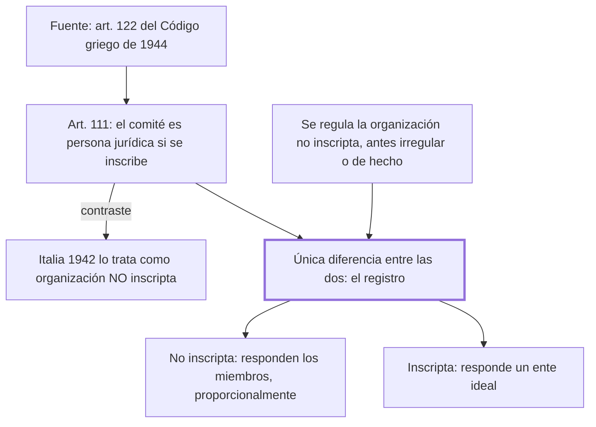

# § 73. El comité como persona jurídica + § 74. Regulación jurídica de la organización de personas no inscripta

## 1. Idea principal

Entre una organización inscripta y una no inscripta lo único que cambia es el registro, y de ese único hecho depende si responde un ente ideal o responden proporcionalmente sus miembros.

Cierra el libro con los dos últimos aportes del código. Es el capítulo donde la construcción teórica se vuelve una consecuencia práctica muy concreta: quién paga.

## 2. Lo esencial del capítulo

El primer aporte es haberle dado al comité la calidad de persona jurídica, siempre que se inscriba. Ni el Código de 1936 lo regulaba ni lo hace con esa categoría ningún otro código vigente (p. 187). El art. 111 lo define como una organización de personas, naturales o jurídicas, dedicada a la recaudación pública de aportes destinados a una finalidad valiosamente altruista, y sus normas se aproximan en parte a las de la asociación y en parte a las de la fundación. La fuente declarada es el art. 122 del Código Civil griego de 1944. La comparación con Italia muestra bien la magnitud del paso: el Código italiano de 1942 regula el comité como organización de personas **no** inscripta, o sea sin reconocerle personalidad jurídica.

El segundo aporte es haber regulado la organización de personas no inscripta, conocida hasta entonces como "irregular" o "de hecho". El argumento es de reparación de un olvido: esas organizaciones venían actuando en la vida comunitaria "por siglos", su presencia es inmemorial, y el Código de 1936 y la codificación comparada las ignoraban. No podía seguir desconociéndose su calidad de sujeto de derecho, o sea de entidad a la que se imputan derechos y deberes.

El tramo decisivo es la comparación entre las dos, y conviene leerlo despacio porque de ahí sale todo. En sus versiones de asociación, fundación, comité o sociedad, la organización no inscripta está formada por un grupo de seres humanos que realiza actos jurídicos de todo tipo, igual que la inscripta. La única diferencia entre las dos es que una está en un registro público y la otra no (p. 188). Pero de esa única diferencia se sigue una consecuencia grande: en la no inscripta, por acción de un dispositivo legal, las situaciones jurídicas subjetivas se atribuyen **a cada uno de sus miembros, proporcionalmente**; en la inscripta se imputan a un ente ideal, inexistente en la realidad, conocido por su expresión lingüística.

Ahí se cierra el arco del libro. Si la persona jurídica es una abstracción y lo único que la separa de la organización de hecho es un trámite, entonces la limitación de responsabilidad que trae la inscripción no es un atributo natural de la personalidad sino un privilegio que el ordenamiento concede, y por eso el autor insiste en llamarlo excepcional. El texto se corta justo cuando iba a desarrollarlo, así que ese cierre conviene leerlo en el original.

## 3. Mapa

## 4. Qué releer del original

1. (p. 188) "La única diferencia entre ambas organizaciones de personas" — es la bisagra del capítulo y de buena parte del libro; la formulación exacta importa.
2. (p. 187) El art. 111 y la referencia al art. 122 del Código griego de 1944 — es donde se ve la fuente del aporte y el contraste con el Código italiano de 1942.
3. (p. 189) El final del capítulo — el texto se interrumpe justo donde iba a explicar el régimen excepcional de la organización inscripta; hay que continuarlo en el original.

## 5. Vocabulario clave

- **Comité** — organización de personas dedicada a la recaudación pública de aportes para una finalidad altruista (art. 111).
- **Organización irregular o de hecho** — el nombre que recibía antes de 1984 la organización de personas no inscripta.
- **Recaudación pública de aportes** — la actividad que caracteriza al comité y lo distingue de la asociación y de la fundación.

## 6. Distinciones que se confunden

- **Organización inscripta vs. no inscripta** — la diferencia es solo el registro, pero cambia quién responde.
  - Se confunden porque: las dos son grupos de personas que realizan actos jurídicos de todo tipo, y desde afuera se comportan igual.
  - Criterio para decidir: ¿a quién se imputan los derechos y deberes? En la no inscripta a cada miembro en proporción; en la inscripta a un ente ideal.
  - Dónde se cae: se contesta que la organización de hecho no puede obligarse, cuando sí puede: lo que cambia es quién responde.

- **El comité en Perú vs. en Italia** — el código peruano lo eleva a persona jurídica; el italiano de 1942 lo deja como organización no inscripta.
  - Se confunden porque: los dos códigos lo regulan y lo definen de modo parecido.
  - Criterio para decidir: ¿se le reconoce personalidad jurídica al inscribirse? Solo el peruano lo hace.
  - Dónde se cae: se presenta la regulación del comité como el aporte, cuando el aporte es la categoría que se le asigna.

## 7. Autoevaluación

1. Un grupo recauda fondos para una escuela y contrae una deuda, sin haberse inscripto. Si no alcanza lo recaudado, ¿quién responde y por qué?
2. Un compañero afirma que el gran aporte del código fue regular el comité. ¿Qué le precisarías comparando con Italia?
3. El autor dice que la única diferencia entre las dos organizaciones es el registro. ¿Qué consecuencia tiene eso para la idea de personalidad jurídica?
4. Se justifica regular la organización de hecho porque "venía actuando por siglos". ¿Es un buen argumento jurídico?

--- No mires esto hasta responder ---

1. Responden los miembros, proporcionalmente. Al no estar inscripta, un dispositivo legal atribuye a cada uno las situaciones jurídicas subjetivas, en vez de imputarlas a un ente ideal (p. 188).
2. Que el Código italiano de 1942 también regula el comité, pero como organización de personas no inscripta. El aporte peruano no es regularlo sino reconocerle la categoría de persona jurídica cuando se inscribe (p. 187).
3. La desnaturaliza como atributo: si dos organizaciones idénticas se distinguen solo por un trámite, la personalidad no es algo que la organización tenga por sí misma sino un efecto que el registro produce. De ahí que la limitación de responsabilidad sea un privilegio concedido y no una consecuencia natural.
4. Como argumento de política legislativa es fuerte: muestra un desajuste entre el derecho y una realidad persistente. Como argumento jurídico no basta por sí solo —la antigüedad de una práctica no la vuelve exigible—, y necesita apoyarse en la razón que da el capítulo anterior: que se le imputan derechos y deberes, o sea que ya funciona como sujeto.

## Flashcards

Qué categoría le dio el Código de 1984 al comité | La de persona jurídica, siempre que se inscriba en el registro
Cómo define el art. 111 al comité | Organización de personas dedicada a la recaudación pública de aportes con fin altruista
En qué se inspiró el código peruano para regular el comité | En el art. 122 del Código Civil griego de 1944
Cómo trata el Código italiano de 1942 al comité | Como organización de personas no inscripta, sin personalidad jurídica
Cómo se llamaba antes de 1984 la organización de personas no inscripta | Irregular o de hecho
Cuál es la única diferencia entre una organización inscripta y una no inscripta | Que una está inscripta en un registro público y la otra no
A quién se imputan los derechos y deberes en la organización no inscripta | A cada uno de sus miembros, proporcionalmente
A quién se imputan en la organización inscripta | A un ente ideal, inexistente en la realidad, conocido por su expresión lingüística
