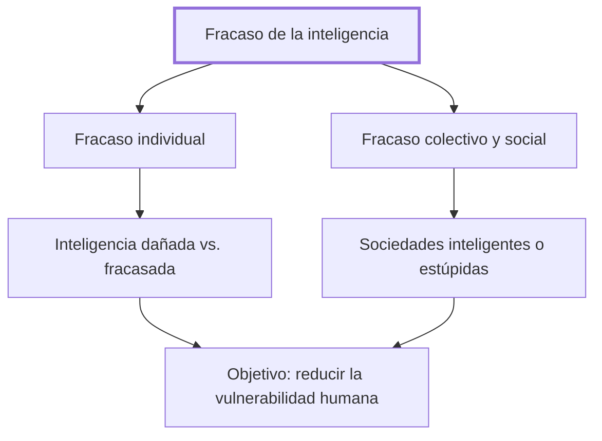

# Introducción

## 1. Idea principal

La inteligencia fracasa cuando no logra ajustarse a la realidad ni resolver problemas afectivos o sociales, y ese fracaso ocurre tanto en personas individuales como en grupos y sociedades enteras.

Este capítulo plantea la pregunta que organiza todo el libro: qué significa exactamente que la inteligencia falle, y por qué conviene estudiar ese fracaso con el mismo rigor que se estudia el éxito. A un principiante le sirve para no quedarse con "estupidez" como insulto, sino verla como un fenómeno que se puede investigar y, en parte, prevenir.

## 2. Lo esencial del capítulo

Marina explica por qué prefiere hablar de "fracasos de la inteligencia" en vez de estupidez: la palabra se volvió un insulto disperso, sin prestancia científica, y por eso retoma la literatura reciente sobre errores de conocimiento y de acción (Introducción). La inteligencia fracasa, dice, cuando no logra ajustarse a la realidad, cuando no comprende lo que pasa, cuando no resuelve problemas afectivos, sociales o políticos, cuando persigue metas disparatadas o medios ineficaces, desaprovecha ocasiones, o se despeña en la crueldad y la violencia (Introducción). Cita la definición de Carlo Cipolla —llama estúpido a quien perjudica a otro sin sacar provecho propio— pero la juzga insuficiente: faltan quienes se dañan solo a sí mismos, y quienes dañan a otros aunque sí obtengan beneficio (Introducción).

El fracaso no es solo individual: existe también una inteligencia colectiva que se empobrece en la interacción, un "abaissement du niveau mental" en el que personas brillantes por separado se empantanan juntas (Introducción). Las sociedades pueden ser inteligentes o estúpidas según sus instituciones, valores y metas, y Marina propone leer el nazismo y el régimen soviético en esa clave, como formas de obcecación colectiva (Introducción). Contrasta la idea de Musil de que "la brutalidad es la praxis de la tontería" con el razonamiento de Napoleón, para quien la fuerza es el único lenguaje que entienden las naciones, y deja abierta la pregunta de quién tiene razón (Introducción).

Distingue además la inteligencia dañada —la de quien arrastra un límite que no eligió, como un niño criado en el odio— de la simplemente fracasada, aunque admite que en la práctica ambas llegan a resultados igual de penosos, y pone a Kafka como ejemplo de alguien que vivió su propia existencia como un fracaso (Introducción). Desconfía de la moda posromántica de estetizar el hundimiento ajeno y recuerda la frase de George Steiner de que la cultura no vuelve mejores a las personas (Introducción). Cierra afirmando su optimismo de pedagogo: cree que la inteligencia puede triunfar, y que la finalidad del libro es reducir la vulnerabilidad humana (Introducción).

## 3. Mapa

## 4. Vocabulario clave

- **Fracaso de la inteligencia** — cuando la mente no se ajusta a la realidad, no resuelve problemas afectivos o sociales, o se despeña en la crueldad.
- **Abaissement du niveau mental** — empobrecimiento de la inteligencia de un grupo, aunque cada miembro sea brillante por separado.
- **Inteligencia dañada** — límite que una persona arrastra sin haberlo elegido, como un niño criado en el odio.
- **Inteligencia colectiva** — la capacidad de un grupo o sociedad de ajustarse a la realidad, distinta de la de sus miembros por separado.

## 5. Distinciones que se confunden

- **Inteligencia dañada vs. inteligencia fracasada** — la dañada es un límite impuesto desde afuera sin culpa del sujeto; la fracasada supone no ajustarse pudiendo hacerlo.
  - Se confunden porque: ambas llegan a los mismos resultados penosos, y el propio Marina admite que distinguirlas en la práctica es difícil (Introducción).
  - Criterio para decidir: preguntarse si la persona pudo elegir o si fue moldeada por una circunstancia que no controló, como el odio inoculado en la infancia.
  - Dónde se cae: tratar como responsabilidad del sujeto lo que en realidad es un daño sufrido, o al revés, excusar como daño lo que fue una elección.

## 6. Autoevaluación

1. ¿Qué se entiende por "fracaso de la inteligencia" según Marina, y en qué se diferencia de la estupidez entendida como simple insulto?
2. Un gerente que es agudo y sereno en privado se vuelve errático en las reuniones de directorio, donde el grupo termina decidiendo peor que cualquiera de sus miembros por separado. ¿Qué concepto del capítulo explica este patrón y qué lo distingue de un simple error individual?

--- No mires esto hasta responder ---

1. El fracaso de la inteligencia es la incapacidad de ajustarse a la realidad, comprender lo que pasa, resolver problemas afectivos o sociales, o elegir metas y medios adecuados (Introducción). Incluye también despeñarse en la crueldad o la violencia, y puede darse en un individuo o en un grupo entero. Se diferencia de "estupidez" como insulto en que Marina la trata como objeto de estudio científico, no como una descalificación moral suelta. Por eso prefiere apoyarse en literatura reciente sobre errores de conocimiento y de acción en vez de usar la palabra a secas (Introducción).
2. El patrón corresponde al "abaissement du niveau mental": una interacción grupal que empobrece la inteligencia disponible, aunque cada persona sea brillante sola (Introducción). Se distingue de un error individual porque el problema no está en ninguna persona en particular, sino en la dinámica que se genera entre ellas al reunirse.

## Flashcards

¿Qué es el "abaissement du niveau mental"? | El empobrecimiento de la inteligencia de un grupo por su propia interacción, aunque cada miembro sea brillante por separado.
¿Qué distingue la inteligencia dañada de la fracasada? | La dañada no es responsabilidad del sujeto, como un niño criado en el odio; la fracasada sí supone no ajustarse pudiendo hacerlo.
Según Marina, ¿por qué la definición de Cipolla sobre la estupidez es insuficiente? | Porque deja afuera a quien se perjudica solo a sí mismo y a quien perjudica a otros obteniendo igual un beneficio.
¿Cuál es la finalidad declarada del libro? | Reducir la vulnerabilidad humana, desde el optimismo de un pedagogo que cree que la inteligencia puede triunfar.
