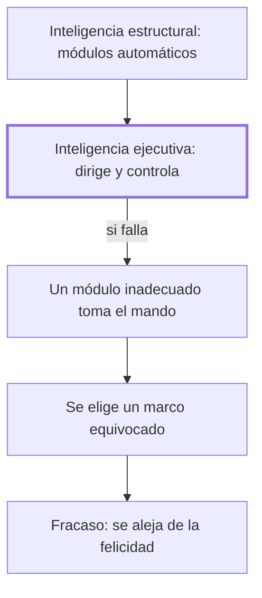

# I. La inteligencia malograda

## 1. Idea principal

La inteligencia puede fallar no porque falte capacidad sino porque un módulo inadecuado domina la conducta por un fallo de la inteligencia ejecutiva encargada de dirigirlo.

Este capítulo distingue la inteligencia dañada de la fracasada y explica por qué una persona brillante puede comportarse de manera estúpida. A un principiante le sirve para entender que el fracaso no es cuestión de capacidad, sino de cómo se dirige esa capacidad en la vida diaria.

## 2. Lo esencial del capítulo

El capítulo arranca con dos casos que plantean la paradoja central del libro: un juez neoyorquino muy respetado que arruinó su carrera acosando a una ex amante, y un alumno de altísimo coeficiente intelectual que terminó preso por decidir usar su inteligencia para mangonear a otros (I). De ahí Marina define la inteligencia como la capacidad de dirigir el comportamiento usando la información que uno mismo capta, aprende y elabora, y aclara que puede fallar en cualquiera de esos pasos (I). Distingue la inteligencia estructural o computacional —la capacidad básica que miden los tests— del uso que se hace de ella, y llama "inteligencia dúplex" a esa relación entre "ser" inteligente y "comportarse" inteligentemente (I). Retoma también la distinción, ya vista en la Introducción, entre inteligencia dañada e inteligencia fracasada, que es el objeto de este libro (I).

Sostiene que buena parte de la inteligencia computacional funciona de manera inconsciente, como módulos semiautónomos construidos por la evolución —el miedo, con sus tres respuestas posibles de huida, inmovilidad o ataque, es su ejemplo (I)—. Esos módulos entran a veces en colisión con la vida moderna, y ahí interviene la inteligencia ejecutiva, encargada de iniciar, dirigir y controlar esas maquinaciones; de ahí saca su primera conclusión, que el fracaso ocurre cuando un módulo inadecuado gana un protagonismo que no merece por un fallo de esa inteligencia ejecutiva (I). Discute además si basta con ser eficaz para ser inteligente —cita a Herbert Simon para mostrar que la razón es apenas instrumental— pero objeta que ese criterio es insuficiente, y lo ilustra con el ejemplo histórico de los "niños de azotes" (I).

Frente a la sola eficacia, propone el "principio de la jerarquía de los marcos": un pensamiento puede ser inteligente en sí mismo y resultar estúpido si el marco donde actúa es estúpido, como muestra —sin repetir aquí sus ejemplos— con la carga de la Brigada Ligera en Balaclava y con el terrorismo suicida (I). Llega así a un tercer principio: la inteligencia fracasa cuando se equivoca de marco, y el marco superior para cualquier persona es su propia felicidad (I). Cierra retomando el caso de Kafka —sus cartas a Felice y a Milena, la "Carta al padre"— como posible ejemplo de inteligencia dañada por vergüenza, y anuncia que el libro se organizará en cuatro apartados: fracasos cognitivos, afectivos, del lenguaje y de la voluntad (I).

## 3. Mapa

## 4. Vocabulario clave

- **Inteligencia ejecutiva** — la que inicia, dirige y controla los mecanismos automáticos de la mente; su fallo causa el fracaso (I).
- **Inteligencia estructural (o computacional)** — la capacidad básica y en gran parte inconsciente que miden los tests de inteligencia (I).
- **Inteligencia dúplex** — la idea de que una cosa es la capacidad intelectual y otra, distinta, el uso que se hace de ella (I).
- **Principio de la jerarquía de los marcos** — un pensamiento inteligente en sí puede resultar estúpido si el marco donde actúa es estúpido (I).

## 5. Distinciones que se confunden

- **Inteligencia estructural vs. inteligencia ejecutiva** — la estructural aporta la capacidad automática; la ejecutiva decide qué hacer con ella y responde por el fracaso.
  - Se confunden porque: un puntaje alto en un test (estructural) hace pensar que el fracaso es imposible, y Marina insiste en que el problema suele estar en la otra (I).
  - Criterio para decidir: preguntarse si a la persona le faltó capacidad para resolver el problema, o si tenía la capacidad y falló en dirigirla.
  - Dónde se cae: atribuir un fracaso a "falta de inteligencia" cuando el propio capítulo muestra personas con tests altísimos que fracasan igual.

## 6. Autoevaluación

1. ¿Qué se entiende por inteligencia según Marina, y por qué distingue entre inteligencia dañada e inteligencia fracasada, retomando lo visto en la Introducción?
2. Una persona con un coeficiente intelectual muy alto arruina su matrimonio por no advertir que actúa movida por celos irracionales que ningún test le midió nunca. ¿Qué nivel de la inteligencia falló aquí según el capítulo, y qué principio explica que su alta capacidad no haya evitado el fracaso?

--- No mires esto hasta responder ---

1. La inteligencia es, para Marina, la capacidad de dirigir el comportamiento usando la información que un sujeto capta, aprende y elabora por sí mismo (I). Distingue la inteligencia dañada, que arrastra un límite de origen sin responsabilidad del sujeto, de la fracasada, que parte de una capacidad intacta pero pierde el rumbo (Introducción; I). Esta segunda es el objeto del libro, porque conserva un elemento trágico: las cosas podrían haber salido de otra manera. El fracaso, sostiene, no depende de la capacidad que miden los tests sino de cómo se la dirige en la vida diaria.
2. Fallaría la inteligencia ejecutiva, que debía dirigir y controlar el módulo afectivo de los celos y no lo hizo (I). Según el principio de la jerarquía de los marcos, un comportamiento puede parecer hábil y aun así ser estúpido si el marco en que actúa —aquí, la vida afectiva— es el equivocado (I). La alta capacidad medida por un test no protege contra este fracaso, porque mide la inteligencia estructural, no su uso.

## Flashcards

¿Qué distingue a la inteligencia estructural de la inteligencia ejecutiva? | La estructural es la capacidad automática que miden los tests; la ejecutiva dirige y controla su uso.
Según el principio de la jerarquía de los marcos, ¿cuándo puede ser estúpido un pensamiento inteligente? | Cuando el marco en el que actúa es en sí mismo estúpido, aunque el pensamiento sea correcto.
¿Cuál es, para Marina, el marco de jerarquía superior para evaluar la conducta de una persona? | Su propia felicidad; cuenta como fracaso todo lo que se la impida.
¿Qué causa el fracaso de la inteligencia según la conclusión de este capítulo? | Que un módulo inadecuado gane protagonismo por un fallo de la inteligencia ejecutiva.
