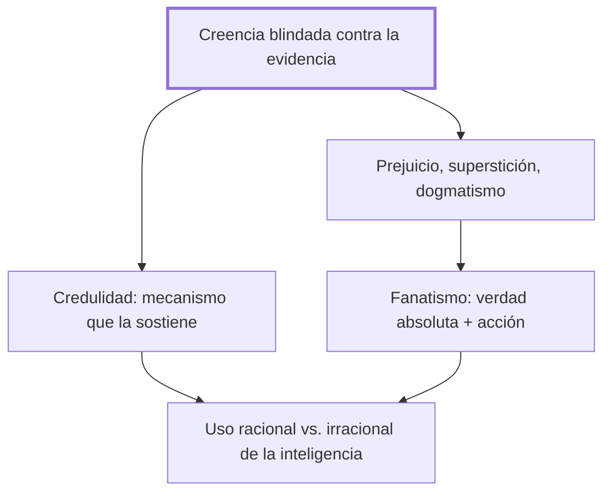

# II. Los fracasos cognitivos

## 1. Idea principal

La inteligencia fracasa cognitivamente cuando una creencia —el prejuicio, la superstición, el dogmatismo o su combinación en el fanatismo— se vuelve invulnerable a la evidencia que la contradice.

Este capítulo explica por qué una persona inteligente puede sostener creencias falsas con total seguridad, y qué mecanismo mental lo permite. A un principiante le sirve para reconocer ese blindaje en sí mismo, no solo para señalarlo en otros.

## 2. Lo esencial del capítulo

Marina arranca distinguiendo el error, que forma parte normal del conocimiento y hasta ayuda a aprender, del fracaso cognitivo propiamente dicho: este aparece cuando una creencia se vuelve invulnerable a la evidencia que la contradice (II). Estudia tres formas de esa invulnerabilidad —el prejuicio, que selecciona la información para confirmarse a sí mismo; la superstición, que sobrevive pese a estar desmentida; el dogmatismo, que acomoda cualquier fracaso de una predicción para no abandonar la creencia previa— y advierte que las tres comparten el mismo mecanismo de blindaje contra la crítica (II).

El fanatismo, sostiene, reúne todos esos fracasos y les suma dos rasgos peligrosos: creerse dueño de una verdad absoluta y pasar de esa certeza a la acción (II). Además de las creencias conscientes, señala que hay creencias implícitas que operan sin que el sujeto se dé cuenta —el pudor, el autoconcepto que el niño construye desde muy pequeño, los roles que una cultura asigna a mujeres y hombres, ilustrados con el contraste entre dos tribus estudiadas por Margaret Mead— y que también pueden ser disfuncionales, como muestran las creencias "tóxicas" que Aaron Beck asocia a la adicción (II).

Cierra con la credulidad, un mecanismo natural para formar creencias por repetición —recuerda el condicionamiento del perro de Pavlov— que la comunicación y el poder pueden explotar, y usa a Napoleón para mostrar cómo la propaganda moldeó su leyenda pública (II). De ahí distingue el uso racional de la inteligencia, que busca evidencias que cualquiera pueda compartir, del uso irracional, que se encierra en un mundo privado blindado a la crítica; ese tránsito hacia lo compartido, apoyado en Piaget, es lo que permite salir del egocentrismo infantil y resulta indispensable para convivir sin violencia (II).

## 3. Mapa

## 4. Vocabulario clave

- **Prejuicio** — creencia sostenida con total seguridad sin saber si es cierta, que selecciona solo la información que la confirma (II).
- **Superstición** — creencia ya desmentida que sigue influyendo aunque quien la sigue no la defienda del todo (II).
- **Dogmatismo** — actitud que, ante una predicción fallida, ajusta los detalles para no abandonar la creencia de fondo (II).
- **Fanatismo** — combinación de los fracasos cognitivos anteriores con la certeza de poseer la verdad absoluta y el llamado a actuar en su nombre (II).
- **Credulidad** — mecanismo natural para formar creencias por repetición, que el poder y la propaganda pueden explotar (II).

## 5. Distinciones que se confunden

- **Razonamiento vs. uso racional de la inteligencia** — el razonamiento es solo la capacidad de hacer inferencias lógicas; el uso racional es aplicarla para buscar evidencias que cualquiera pueda compartir.
  - Se confunden porque: hasta un fanático o alguien con una demencia razona con lógica interna impecable, y el capítulo advierte que eso no basta para llamarlo racional (II).
  - Criterio para decidir: preguntarse si las conclusiones buscan apoyarse en evidencias que cualquiera podría verificar, o si solo blindan una creencia privada.
  - Dónde se cae: llamar "racional" a un razonamiento bien armado que en realidad protege un prejuicio o una superstición de toda crítica.

## 6. Autoevaluación

1. ¿Qué se entiende por un fracaso cognitivo de la inteligencia, y cómo se relaciona con la distinción entre inteligencia estructural e inteligencia ejecutiva vista en el capítulo I?
2. Una persona rechaza sistemáticamente cualquier evidencia médica que contradiga un remedio alternativo en el que confía, y reinterpreta cada fracaso del tratamiento como prueba de que "no se siguió bien el método". ¿Qué fenómeno del capítulo describe mejor esta actitud, y en qué se diferencia de un simple error?

--- No mires esto hasta responder ---

1. Un fracaso cognitivo ocurre cuando una creencia —un prejuicio, una superstición o un dogmatismo— se vuelve invulnerable a la evidencia que la contradice, a diferencia del error normal, que sí se corrige con nueva información (II). Ocurre, como ya se vio en el capítulo I, cuando un módulo mental queda encapsulado y la inteligencia ejecutiva no logra someterlo a revisión (II; I). El fanatismo es su forma más peligrosa, porque además de blindar la creencia empuja a actuar en su nombre. En todos los casos, lo que falla no es la capacidad de razonar sino el uso que se hace de ella.
2. Se trata de un caso de dogmatismo: la predicción fallida no lleva a abandonar la creencia, sino a introducir un ajuste que la protege de la refutación (II). Se diferencia de un error simple en que el error se corrige con la nueva evidencia, mientras que el dogmatismo la neutraliza para poder seguir creyendo lo mismo.

## Flashcards

¿Qué es un prejuicio, según la definición que retoma Marina de Gordon Allport? | Estar absolutamente seguro de algo que en realidad no se sabe.
¿Qué dos elementos añade el fanatismo a los demás fracasos cognitivos? | La certeza de poseer la verdad absoluta y el paso de esa certeza a la acción.
¿Qué distingue al dogmatismo de un simple error? | El dogmatismo ajusta la creencia para protegerla del fracaso de una predicción, en vez de abandonarla.
¿Qué mecanismo explota Napoleón para moldear su imagen pública, según el capítulo? | La credulidad, la tendencia a creer lo que se repite por distintos canales que se corroboran entre sí.
