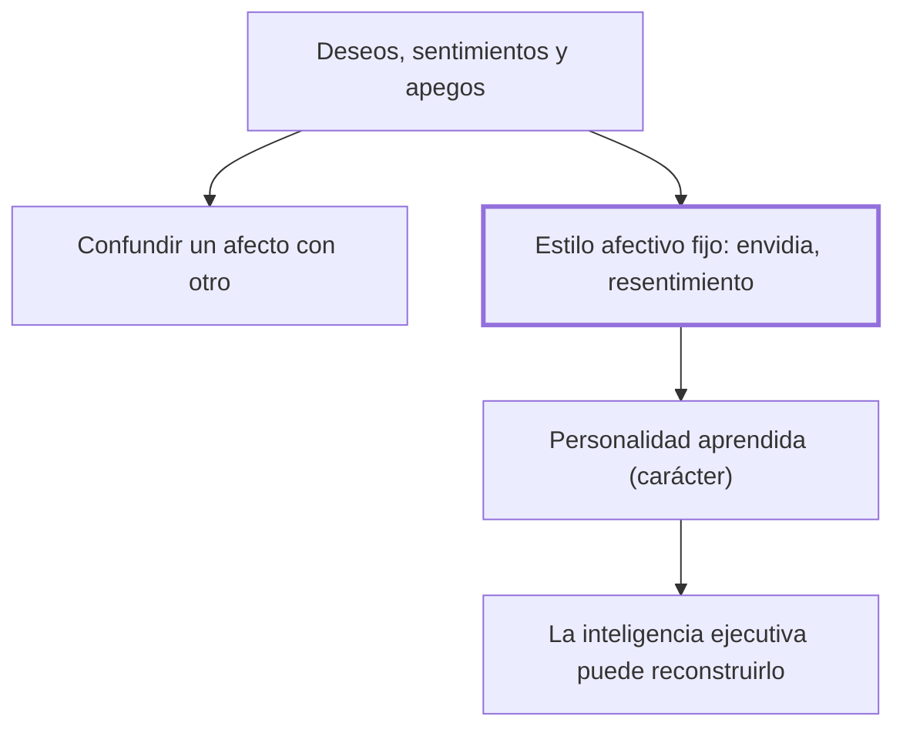

# III. Los fracasos afectivos

## 1. Idea principal

La inteligencia fracasa afectivamente cuando confunde un afecto con otro o cuando un estilo emocional como la envidia o el resentimiento termina dirigiendo la conducta entera de una persona.

Este capítulo explica por qué razonar bien no basta para decidir bien, y por qué ciertos afectos, aprendidos con los años, pueden apoderarse de una vida entera sin que la persona lo note. A un principiante le sirve para distinguir, en su propia experiencia, qué siente de verdad de qué solo cree sentir.

## 2. Lo esencial del capítulo

Marina muestra, apoyado en los pacientes de Antonio Damasio con el lóbulo frontal desconectado del área límbica, que sin el empuje afectivo la razón puede quedar atrapada en una deliberación interminable, incapaz de decidir aunque razone perfectamente (III). De ahí rechaza que existan una inteligencia cognitiva y otra emocional separadas, y organiza la vida afectiva en tres niveles: los impulsos o deseos, los sentimientos que informan cómo van esos deseos frente a la realidad, y los apegos, vínculos duraderos con personas o hábitos que a veces persisten sin que el sujeto los reconozca (III).

El primer fracaso afectivo, sostiene, es confundir un afecto con otro: creer amor lo que en realidad es vanidad, lástima o el simple deseo de conquistar, y solo el dolor de la ausencia —como en el caso de Proust que cita— revela después cuál era el afecto verdadero (III). Estudia también estilos afectivos que terminan gobernando toda una vida, como la envidia y sobre todo el resentimiento, que Scheler describe como una intoxicación por reprimir sistemáticamente ciertas emociones; toma a Ricardo III de Shakespeare como su gran ejemplo de una inteligencia hábil pero enteramente malograda por el rencor (III).

Cierra proponiendo tres capas de la personalidad: la recibida, herencia genética con la que se empieza a jugar; la aprendida o carácter, formada por hábitos afectivos y cognitivos, entre ellos los estilos ya descritos; y la elegida, obra de la inteligencia ejecutiva, que decide cómo jugar esas cartas en cada situación concreta (III). Con la metáfora del póquer —no gana quien tiene mejor mano, sino quien mejor la juega— sostiene que los estilos afectivos, aunque muy estables, se aprendieron y por lo tanto se pueden reconstruir con paciencia, igual que se aprende un idioma nuevo (III).

## 3. Mapa

## 4. Vocabulario clave

- **Apego** — vínculo psicológico duradero con una persona, hábito o experiencia, que puede persistir sin que el sujeto lo note (III).
- **Estilo afectivo** — patrón estable de sentir (depresivo, envidioso, optimista...) que una persona aprende y aplica una y otra vez ante la realidad (III).
- **Personalidad recibida** — la matriz genética de partida: funciones intelectuales básicas, temperamento y sexo (III).
- **Personalidad aprendida (carácter)** — el conjunto de hábitos afectivos y cognitivos construidos sobre la personalidad recibida (III).
- **Personalidad elegida** — cómo una persona concreta decide jugar sus cartas en una situación dada; obra de la inteligencia ejecutiva (III).

## 5. Distinciones que se confunden

- **Personalidad aprendida vs. personalidad elegida** — la aprendida es el carácter ya formado por hábitos; la elegida es la decisión concreta de cómo actuar con ese carácter en cada situación.
  - Se confunden porque: ambas se sienten como "así soy yo", y es difícil saber si un comportamiento viene del hábito o de una decisión tomada ahora mismo (III).
  - Criterio para decidir: preguntarse si, en esta situación puntual, había margen real para responder de otra manera dado el carácter que se tiene.
  - Dónde se cae: usar "es mi carácter" para excusar una decisión evitable, o exigirse cambiar de golpe un hábito que en realidad pertenece a la personalidad aprendida.

## 6. Autoevaluación

1. ¿Qué se entiende por un fracaso afectivo de la inteligencia, y cómo se relaciona con la idea, vista en el capítulo I, de un módulo que toma el mando de la conducta?
2. Una persona insiste en que "siempre fue así" de celosa y que no puede evitarlo, aunque reconoce que sus celos empeoraron después de una infidelidad que sufrió hace años. Usando la distinción entre personalidad aprendida y personalidad elegida, ¿qué margen de cambio tiene según el capítulo?

--- No mires esto hasta responder ---

1. Un fracaso afectivo ocurre cuando se confunde un afecto con otro, o cuando un estilo afectivo —como la envidia o el resentimiento— se apodera de la conducta entera de una persona (III). Se relaciona con la idea del capítulo I porque ese estilo funciona igual que un módulo encapsulado: gana un protagonismo que no merece y la inteligencia ejecutiva no logra someterlo a control (III; I). La diferencia es que aquí el módulo es afectivo, no cognitivo. En ambos casos, lo que falla es la dirección, no la capacidad de sentir o de pensar.
2. Sus celos forman parte de su personalidad aprendida, un hábito afectivo consolidado por una experiencia biográfica concreta, y no de una matriz genética inmodificable (III). Precisamente por haberse aprendido, el capítulo sostiene que puede reconstruirse con paciencia, igual que se aprende un idioma nuevo. El margen de cambio existe, aunque exija tiempo, porque no se trata de un rasgo de la personalidad recibida.

## Flashcards

¿Qué mostró Damasio con los pacientes que tenían el lóbulo frontal desconectado del área límbica? | Razonaban bien y aprobaban los tests de inteligencia, pero no lograban tomar decisiones.
¿Cuáles son los tres niveles de la vida afectiva según Marina? | Los impulsos o deseos, los sentimientos que evalúan cómo van esos deseos, y los apegos.
¿Cuáles son las tres capas de la personalidad que distingue el capítulo? | La personalidad recibida, la aprendida o carácter, y la elegida por la inteligencia ejecutiva.
Según la metáfora del póquer, ¿qué determina si alguien tiene una vida inteligente? | No las cartas que le tocaron, sino qué tan bien las juega.
