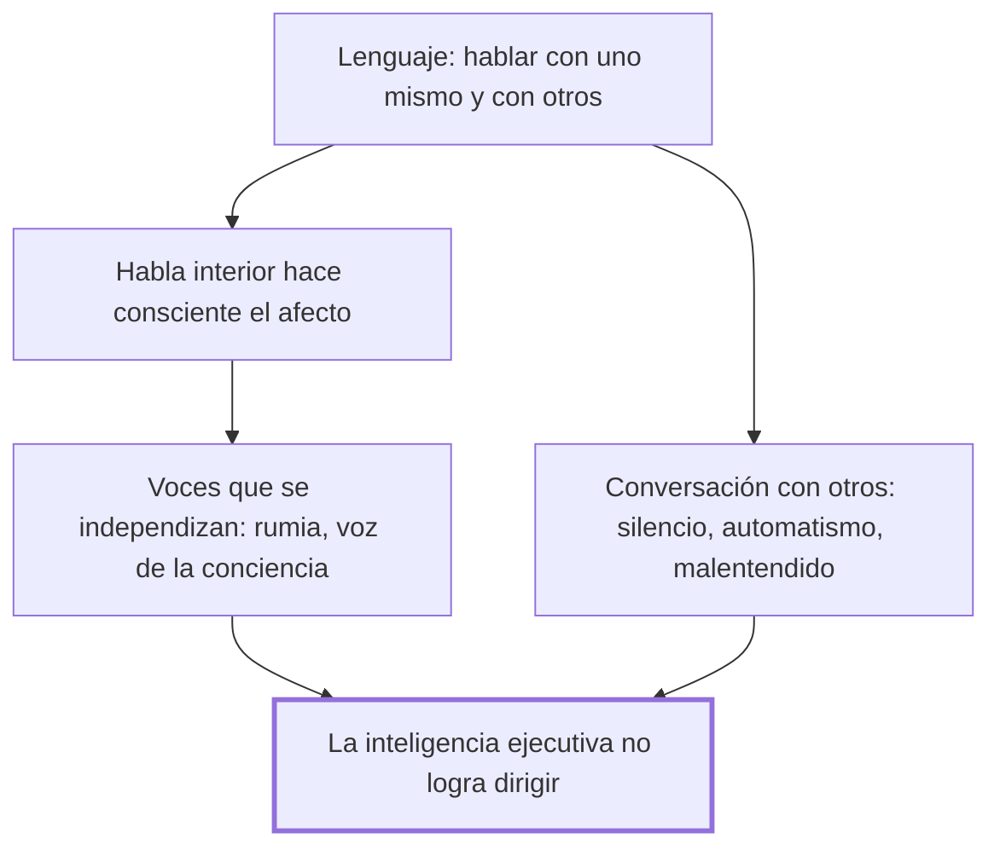

# IV. Los lenguajes fracasados

## 1. Idea principal

El lenguaje, que debería servir para entenderse con uno mismo y con los demás, fracasa cuando se rigidiza en hábitos, voces o malentendidos que la inteligencia ejecutiva ya no logra dirigir.

Este capítulo explora dos frentes distintos: el diálogo interior que nos permite pensar y decidir, y la conversación con otros, sobre todo en la pareja. A un principiante le sirve para reconocer cuándo una discusión doméstica dejó de ser una conversación y empezó a moverse sola.

## 2. Lo esencial del capítulo

Marina arranca con el matrimonio de ¿Quién teme a Virginia Woolf? como ejemplo de que el lenguaje, hecho para entender y para vivir, puede volverse un arma de demolición doméstica (IV). Distingue dos frentes de fracaso, hablar con uno mismo y hablar con los demás, y en el primero muestra que el habla interior es la herramienta con que la inteligencia ejecutiva se vuelve consciente de sí misma, apoyado en los pacientes con el cerebro dividido de su maestro Sperry, donde la "personalidad" que dirige la conducta resultó ser la del hemisferio que habla (IV). Retoma también a Freud para sostener que poner en palabras un afecto es lo que permite pasarlo de lo inconsciente a lo consciente, y distingue dos fracasos de esa introspección: su ausencia, que deja una inteligencia tosca e impulsiva, y su exceso, la rumia obsesiva que da vueltas sin avanzar (IV).

Señala que cada deseo o sentimiento puede convertirse en una voz interior, y que esas voces a veces se independizan hasta el punto de que el sujeto olvida que las produjo su propia mente, como en las alucinaciones que cita de Castilla del Pino; la voz de la conciencia —que Kant, Freud o Heidegger describieron de maneras distintas— corre el mismo riesgo si el criterio que aplica es equivocado (IV). En el frente de hablar con otros, distingue cuatro fracasos típicos de la conversación de pareja: el silencio que se instala cuando faltan las ocurrencias, el automatismo de un discurso que arrastra a los hablantes adonde no querían llegar, el malentendido hermenéutico, y la sumisión a expectativas de género distintas entre hombres y mujeres (IV).

Del automatismo del discurso da un ejemplo cotidiano: la misma queja sobre un jefe autoritario desencadena reconciliación o pelea según la primera respuesta de la pareja, sin que ninguno de los dos lo haya decidido de antemano (IV). Del malentendido, rechaza la metáfora de que hablar es "entregar" un contenido ya hecho, y usa un diálogo de pareja de Watzlawick —donde un elogio repetido termina sin significar nada— para mostrar que siempre interpretamos, nunca recibimos un significado puro (IV); sobre las expectativas de género remite al original, sin repetir aquí sus ejemplos (IV). Cierra con tres causas del fracaso lingüístico: malos hábitos de la inteligencia computacional, malos criterios de la inteligencia ejecutiva, o su incapacidad para dirigir a la primera (IV).

## 3. Mapa

## 4. Vocabulario clave

- **Habla interior** — el diálogo con uno mismo que hace consciente el afecto y permite dirigir la propia conducta (IV).
- **Alexitimia** — incapacidad de una persona para reconocer y expresar sus propios sentimientos (IV).
- **Rumia** — repetición circular de una preocupación en la mente, que agota sin resolver nada (IV).
- **Equivocación hermenéutica** — malentendido que surge de creer que hablar es entregar un significado ya hecho, en vez de interpretarlo (IV).

## 5. Distinciones que se confunden

- **Silencio como fracaso del lenguaje vs. silencio como serenidad** — el primero es la falta de una palabra que se necesitaba o se esperaba; el segundo es una ausencia de habla elegida y en paz.
  - Se confunden porque: el capítulo usa la misma palabra, "silencio", para dos situaciones casi opuestas, y solo el contexto afectivo permite distinguirlas (IV).
  - Criterio para decidir: preguntarse si alguien en esa situación deseaba o esperaba una palabra que no llegó, o si el silencio era una decisión serena y compartida.
  - Dónde se cae: tratar cualquier silencio de pareja como síntoma de fracaso, sin advertir que a veces es sencillamente paz.

## 6. Autoevaluación

1. ¿Qué se entiende por un fracaso del lenguaje según Marina, y cómo se conecta con la idea, vista en el capítulo I, de que el fracaso ocurre cuando la inteligencia ejecutiva no logra dirigir un módulo?
2. Una pareja discute todas las noches sobre el mismo tema sin haber decidido nunca hacerlo: basta con que uno mencione el trabajo para que la conversación escale sola hacia el reproche. ¿Qué tipo de fracaso lingüístico describe mejor esta situación, y qué lo distingue de un simple malentendido?

--- No mires esto hasta responder ---

1. Para Marina, el lenguaje fracasa cuando, siendo un medio de entendimiento, produce incomprensión: se vuelve rígido y mecaniza la forma en que se usa, se expresa o se interpreta (IV). Esto ocurre por tres vías: la inteligencia computacional adquiere malos hábitos, la inteligencia ejecutiva adopta malos criterios, o esta última es incapaz de dirigir a la primera (IV). Es la misma estructura vista en el capítulo I, donde el fracaso general de la inteligencia se explicaba por un módulo inadecuado que la inteligencia ejecutiva no lograba someter a control (IV; I). Aquí el módulo son los hábitos y automatismos del propio lenguaje.
2. Es un caso de automatismo del discurso: la conversación sigue una dinámica que ninguno de los dos decidió, y que los arrastra a un desenlace no querido (IV). Se distingue del malentendido en que aquí no hay una interpretación equivocada de lo que el otro dijo, sino una escalada mecánica que se dispara sola apenas se toca el tema.

## Flashcards

¿Qué mostraron los pacientes de Sperry con el cerebro dividido, respecto al lenguaje? | Que la inteligencia ejecutiva, la que dirige la conducta, residía en el hemisferio que hablaba.
¿Cuáles son los dos fracasos de la introspección que describe el capítulo? | La ausencia de habla interior, que da una inteligencia tosca, y su exceso, la rumia obsesiva.
¿Qué es la alexitimia? | La incapacidad de una persona para reconocer y expresar sus propios sentimientos.
¿Cuáles son las tres causas del fracaso del lenguaje según la conclusión del capítulo? | Malos hábitos computacionales, malos criterios ejecutivos, o que la ejecutiva no dirige a la computacional.
