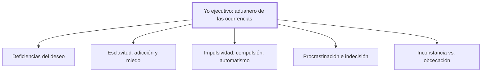

# V. El fracaso de la voluntad

## 1. Idea principal

La voluntad —cuatro habilidades aprendidas, no una facultad innata— fracasa cuando un deseo, una adicción o un hábito le arrebatan el control a un yo ejecutivo demasiado rígido o demasiado laxo.

Este capítulo inventaría los modos en que esa voluntad puede fallar en su tarea de controlar los impulsos, desde la apatía hasta la adicción y la tozudez. A un principiante le sirve para reconocer que la fuerza de voluntad no es una virtud única, sino varias habilidades distintas que pueden fallar por separado.

## 2. Lo esencial del capítulo

Marina retoma la voluntad, expulsada de la psicología, como cuatro habilidades aprendidas —inhibir el impulso, deliberar, decidir, mantener el esfuerzo— y la reduce a un "yo ejecutivo" que funciona como un aduanero: no genera ninguna ocurrencia propia, solo las deja pasar, las bloquea o las devuelve para que se mejoren, según sus criterios de evaluación (V). Ilustra ese proceso con anécdotas de creación artística —Valéry, García Márquez, Picasso, entre otros que no repito aquí— para mostrar que ni siquiera el genio se libra de esa doble tarea de generar y seleccionar (V). Aclara que en este capítulo estudia solo los fracasos estructurales de esa voluntad, y deja el "uso fracasado" para el capítulo siguiente (V).

Presenta una tipología de esos fracasos estructurales. Las deficiencias del deseo van desde la falta total de impulso, como en la depresión, hasta su volubilidad excesiva, o el deseo que nunca se articula en un proyecto real (V). La esclavitud de la voluntad aparece en las adicciones y en el miedo, cuando el sujeto siente que no puede dejar de actuar aunque quiera (V). Distingue además tres formas de perder el control del impulso —impulsividad, compulsión y automatismo—, según haya o no conciencia y lucha interna, e ilustra la impulsividad extrema con el crimen sin motivo aparente de A sangre fría (V).

Añade la procrastinación, un aplazamiento sistemático con tácticas propias que ilustra con un test de autodiagnóstico que no repito aquí; la indecisión, que en su forma patológica reaparece en los pacientes de Damasio ya vistos; la rutina, útil cuando automatiza lo simple pero peligrosa si se aplica sin vigilancia a un problema nuevo; y un par final, la inconstancia y su opuesto, la obcecación —ilustrada con el experimento del caramelo de Mischel y con la matanza de Verdún— (V). Cierra con la conclusión que reúne todo el capítulo: la voluntad fracasa siempre por una toma indebida de poder de un módulo sobre un yo ejecutivo demasiado rígido o demasiado laxo, y no existe un criterio único válido para todos los casos (V).

## 3. Mapa

## 4. Vocabulario clave

- **Procrastinación** — aplazar sistemáticamente una tarea con tácticas dilatorias, no un simple posponer ocasional (V).
- **Abulia** — incapacidad de pasar del deseo a la acción, aunque el deseo esté presente (V).
- **Impulsividad** — falta de control del impulso: se pasa directamente al acto, sin deliberación ni lucha interna (V).
- **Compulsión** — acción que el sujeto reconoce como absurda pero repite tras una lucha interna que pierde (V).
- **Esclavitud de la voluntad** — cuando una adicción o un miedo limita tanto las opciones que el sujeto siente que no puede dejar de actuar (V).

## 5. Distinciones que se confunden

- **Impulsividad vs. compulsión** — en la impulsividad se pasa al acto sin deliberar ni luchar contra el impulso; en la compulsión el sujeto lucha contra la acción y solo cede después de resistirse.
  - Se confunden porque: ambas terminan en una conducta que el sujeto no controla del todo, y a simple vista parecen la misma pérdida de control (V).
  - Criterio para decidir: preguntarse si hubo lucha interna previa contra el impulso, o si se pasó directo a la acción sin deliberación.
  - Dónde se cae: llamar "impulsivo" a alguien que en realidad lucha en secreto contra rituales que reconoce como absurdos, que es compulsión, no impulsividad.

## 6. Autoevaluación

1. ¿Qué se entiende por voluntad según Marina, y cómo se relaciona ese "yo ejecutivo" con la inteligencia ejecutiva descripta desde el capítulo I?
2. Una persona revisa la cerradura de su puerta cuatro veces cada noche, reconoce que es absurdo, e intenta resistirse sin éxito antes de ceder. Otra persona, en cambio, grita y golpea una pared apenas se enoja, sin pensarlo un segundo. ¿Qué fracaso de la voluntad describe cada caso, y qué los distingue?

--- No mires esto hasta responder ---

1. La voluntad es, para Marina, la motivación dirigida inteligentemente: no una facultad innata sino cuatro habilidades aprendidas —inhibir el impulso, deliberar, decidir y mantener el esfuerzo— (V). El "yo ejecutivo" que la dirige funciona como un aduanero que no genera ninguna ocurrencia propia, sino que deja pasar, bloquea o devuelve las que le llegan de la inteligencia computacional, según sus criterios de control y evaluación (V). Es la misma inteligencia ejecutiva descripta desde el capítulo I, aplicada ahora a controlar el impulso y sostener el esfuerzo en el tiempo (V; I). Cuando falla, es porque le falta energía para controlar o porque sus criterios son inadecuados.
2. El primer caso es una compulsión: hay lucha interna contra un acto que el sujeto reconoce como absurdo, y cede solo después de resistirse (V). El segundo es impulsividad: se pasa directo a la acción, sin deliberación ni forcejeo previo con el impulso. La diferencia central es la presencia o ausencia de esa lucha interna antes de actuar.

## Flashcards

¿Cuáles son las cuatro habilidades que componen la "nueva voluntad" según Marina? | Inhibir el impulso, deliberar, decidir y mantener el esfuerzo.
¿Qué dos tareas cumple el "yo ejecutivo", comparado con un aduanero? | Controlar el tráfico de ocurrencias y evaluarlas según sus propios criterios.
¿Qué distingue a la abulia de la impulsividad? | En la abulia falta la capacidad de pasar del deseo a la acción; en la impulsividad falta la capacidad de frenarla.
Según la conclusión del capítulo, ¿de dónde vienen siempre los fracasos de la voluntad? | De una toma indebida de poder de un módulo sobre un yo ejecutivo demasiado rígido o demasiado laxo.
