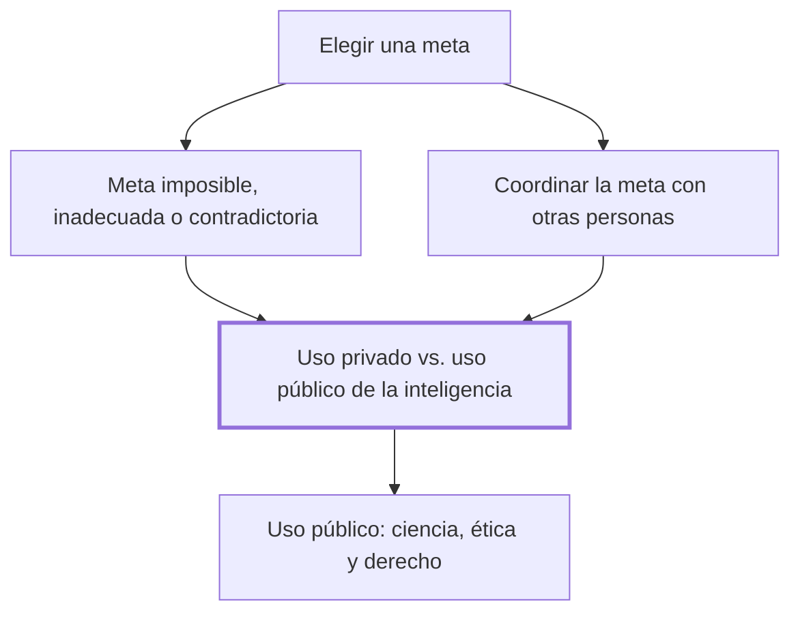

# VI. La elección de las metas

## 1. Idea principal

La inteligencia fracasa al elegir metas imposibles, contradictorias o mal coordinadas con otros, y ese fracaso se agrava cuando el uso privado de la inteligencia se impone al uso público que hace posible la convivencia.

Este capítulo explica por qué elegir bien una meta es tan importante como perseguirla, y por qué una persona puede triunfar en su vida privada mientras arruina a los demás. A un principiante le sirve para distinguir cuándo un conflicto se resuelve con criterios propios y cuándo exige salir a un terreno compartido con otros.

## 2. Lo esencial del capítulo

Marina arranca de una carta de Kafka a Felice que confiesa la incompatibilidad entre escribir y una vida compartida, para mostrar que buena parte de nuestros fracasos vienen de elegir mal las metas, no de fallar en el camino hacia ellas (VI). Distingue metas imposibles en sí —como la frase perfecta que persigue el escritor de La peste, de Camus, hasta enloquecer— de metas posibles que resultan imposibles para una persona concreta, como el comandante de El motín del Caine, incapaz de distinguir lo importante de lo trivial (VI). Suma un tercer fracaso, las metas contradictorias que no se perciben como tales —ilustra con dobles vínculos como el de exigir "sé más espontáneo"—, y advierte que calibrar la propia capacidad frente a una meta es tan delicado como elegirla (VI).

Al coordinar metas con otras personas, distingue tres modelos de pareja o familia —sumisión de un plan al otro, negociación de dos planes privados, o subordinación de ambos a una meta común— y advierte que el modelo puramente contractual actual, al preparar a cada uno para un posible divorcio desde el principio, puede convertirse en una profecía que se cumple sola (VI). De ahí salta al individualismo, triunfo posible de la inteligencia privada y fracaso de la colectiva, y llega a distinguir un uso privado y un uso público de la inteligencia, cada uno con sus criterios (VI). Ilustra esa doble vara con Napoleón: una inteligencia estructural extraordinaria, bien usada en su despacho privado, pero puesta al servicio de una ambición que costó millones de vidas en el terreno público (VI).

Sostiene que el uso público de la inteligencia —del que nacen la ciencia, la ética y el derecho— es indispensable para evitar la tiranía y la "tragedia de los bienes comunes" que describió Garrett Hardin, porque lo que conviene a un individuo aislado puede perjudicar a la comunidad entera (VI). Repasa varias teorías que intentaron fundar un "sujeto ético" capaz de juzgar con objetividad —el espectador imparcial de Adam Smith, el imperativo categórico de Kant, el velo de la ignorancia de Rawls, el diálogo de Habermas— pero advierte que ninguna convence a quien decide no salir de su reducto privado (VI). Cierra sin resolver el dilema: qué jerarquía debe imponerse entre el uso público y el uso privado de la inteligencia, cuestión que deja planteada para el capítulo siguiente (VI).

## 3. Mapa

## 4. Vocabulario clave

- **Uso privado de la inteligencia** — el que persigue metas y criterios propios, sin necesidad de justificarse ante nadie más (VI).
- **Uso público de la inteligencia** — el que se somete a criterios compartibles, como los de la ciencia, la ética o el derecho (VI).
- **Doble vínculo** — exigencia contradictoria que se anula a sí misma, como pedirle a alguien que "sea más espontáneo" (VI).
- **Sujeto ético** — la posición imparcial que distintas teorías inventaron para juzgar con justicia, más allá del propio interés (VI).

## 5. Distinciones que se confunden

- **Uso privado vs. uso público de la inteligencia** — el privado evalúa el éxito con metas propias; el público, con criterios que cualquiera podría aceptar, como la ciencia, la ética o el derecho.
  - Se confunden porque: una persona puede triunfar rotundamente en el uso privado —como Napoleón en su despacho— y aun así fracasar, o hacer daño, en el uso público (VI).
  - Criterio para decidir: preguntarse si el criterio de éxito que se aplica solo vale para quien actúa, o si cualquier otro afectado lo aceptaría también.
  - Dónde se cae: llamar "inteligente" sin más a alguien eficaz en lo privado, sin evaluar el costo que su éxito le impone a los demás.

## 6. Autoevaluación

1. ¿Qué se entiende por uso privado y uso público de la inteligencia, y por qué Marina puede llamar a Napoleón inteligente y destructor a la vez?
2. Un empresario tala ilegalmente un bosque comunal porque le resulta muy rentable a corto plazo, aunque eso perjudique a toda la comunidad que depende de ese bosque. ¿Qué concepto del capítulo describe este caso, y qué uso de la inteligencia elige el empresario?

--- No mires esto hasta responder ---

1. El uso privado de la inteligencia evalúa el éxito con las metas y los criterios de quien actúa, sin necesidad de justificarse ante nadie más; el uso público se somete a criterios compartibles, los de la ciencia, la ética o el derecho (VI). Marina llama a Napoleón inteligente porque en su despacho privado organizó la información, decidió con rapidez y consiguió sus metas con una eficacia extraordinaria. Pero, considerado desde sus víctimas, fue un destructor, porque su ambición costó millones de vidas y frenó los avances de la Revolución Francesa. Ambas cosas son ciertas a la vez porque describen dos usos distintos de la misma inteligencia estructural.
2. Se trata de lo que el capítulo llama, siguiendo a Garrett Hardin, la tragedia de los bienes comunes: lo que conviene a un individuo aislado perjudica a la comunidad entera (VI). El empresario elige el uso privado de la inteligencia, que persigue su propio beneficio, en vez del uso público, que exigiría someterse a un criterio que los demás afectados también pudieran aceptar.

## Flashcards

¿Qué es un doble vínculo, según el ejemplo que da el capítulo? | Una exigencia que se anula a sí misma, como pedirle a alguien que "sea más espontáneo".
¿Cuáles son los tres problemas básicos que enfrentamos al elegir una meta, según Marina? | No saber qué hacer, saber qué pero no cómo, y saber cómo pero no atreverse.
¿Qué diferencia el uso privado del uso público de la inteligencia? | El privado se evalúa con metas propias; el público, con criterios que cualquier afectado podría aceptar.
¿Qué idea usó Garrett Hardin para mostrar el límite del uso privado de la inteligencia? | La tragedia de los bienes comunes: lo que conviene a un individuo puede perjudicar a toda la comunidad.
