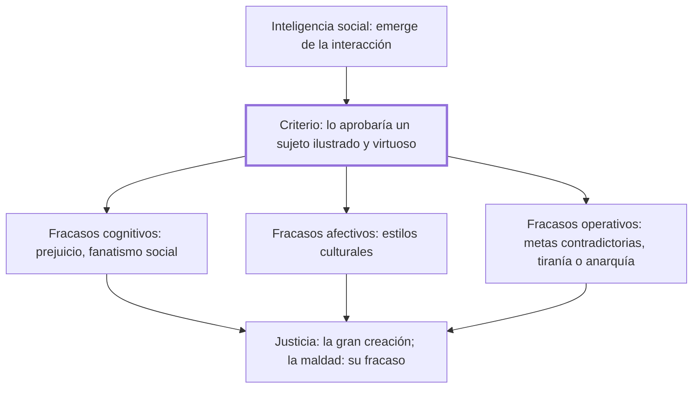

# VII. Sociedades inteligentes y sociedades estúpidas

## 1. Idea principal

Una sociedad es inteligente cuando sus formas de vida serían aprobadas por un sujeto ilustrado y virtuoso que use públicamente su inteligencia, y fracasa con la intolerancia, la tiranía o metas contradictorias.

Este capítulo extiende a las sociedades enteras los mismos fracasos ya vistos en el individuo: cognitivos, afectivos y operativos. A un principiante le sirve para entender que una sociedad puede ser tan estúpida como una persona, aunque esté compuesta por individuos brillantes.

## 2. Lo esencial del capítulo

Marina distingue la inteligencia personal —que puede usarse en privado o en público— de la inteligencia social propiamente dicha, que no es la suma de las inteligencias de un grupo sino algo que emerge de su interacción, como el lenguaje o las modas, que nadie inventa solo (VII). La resume en una fórmula: inteligencia social es igual a las inteligencias personales más los sistemas de interacción pública más la organización del poder (VII). Frente a la tentación de medir el éxito social por el consenso mayoritario, propone otro criterio: una sociedad acierta cuando sus formas de vida son las que aprobaría un sujeto ilustrado y virtuoso, en pleno uso público de su inteligencia, tras examinar críticamente la información disponible (VII).

Traslada a lo social la misma tríada de fracasos vista en capítulos anteriores. Los cognitivos son creencias blindadas —prejuicio, dogmatismo, fanatismo— que una cultura entera puede sostener, y los ilustra con el vaivén histórico de quien reclama tolerancia religiosa mientras es perseguido y la niega apenas llega al poder, de los cristianos primitivos a la Reforma (VII). Los afectivos son estilos que una sociedad entera fomenta, como el contraste que describió Margaret Mead entre los cooperadores arapesh y los hostiles mundugumor, o la falta social de compasión, respeto y admiración que señala Fukuyama (VII).

Los operativos aparecen cuando una sociedad elige metas contradictorias —la eficacia y la estatalización total de la economía soviética, por ejemplo— o cuando su sistema ejecutivo falla por exceso (tiranía) o por defecto (anarquía); distingue además terminar un conflicto de resolverlo, porque solo lo segundo deja a salvo la convivencia futura (VII). Cierra distinguiendo tres tipos de verdad —privada, privada colectiva y universal— para proponer un principio: cuando una verdad privada, como una creencia religiosa, entra en conflicto con una verdad universal en asuntos que afectan a otros, debe ceder ante esta última (VII). Termina con su fórmula más compacta: la justicia es la gran creación de la inteligencia, y la maldad su fracaso definitivo (VII).

## 3. Mapa

## 4. Vocabulario clave

- **Inteligencia social (o comunitaria)** — la que emerge de la interacción entre personas, como el lenguaje o las modas; no es la suma de sus inteligencias individuales (VII).
- **Verdad privada** — evidencia que solo vale para quien la vive, como la confianza en una persona, y no puede universalizarse (VII).
- **Verdad privada colectiva** — creencia compartida por un grupo, como una fe religiosa, cuyo consenso no la vuelve universal (VII).
- **Verdad universal** — evidencia corroborada por métodos rigurosos y en principio al alcance de cualquiera, como las de la ciencia (VII).

## 5. Distinciones que se confunden

- **Terminar un conflicto vs. resolverlo** — terminar es que el conflicto deje de manifestarse, aunque sea por la fuerza; resolverlo es dejar a salvo los valores de la convivencia para que no vuelva a estallar.
  - Se confunden porque: ambos hacen que el conflicto "desaparezca" de la vista por un tiempo, y solo se nota la diferencia cuando el problema retoña (VII).
  - Criterio para decidir: preguntarse si la solución dejó intactas las causas y los valores en juego, o si solo silenció a una de las partes.
  - Dónde se cae: celebrar como "solución" la victoria de una parte sobre otra, cuando en realidad solo pospone el mismo conflicto.

## 6. Autoevaluación

1. ¿Qué se entiende por inteligencia social según Marina, y cómo retoma la distinción entre uso privado y uso público de la inteligencia vista en el capítulo VI?
2. Dos países en guerra firman un cese el fuego después de que uno de ellos arrasa las ciudades del otro y este deja de resistir. ¿Este desenlace cuenta como una solución del conflicto, según el criterio del capítulo? Justifique con el ejemplo de Amos Oz.

--- No mires esto hasta responder ---

1. La inteligencia social es, para Marina, la que emerge de la interacción entre personas —como el lenguaje o las costumbres— y no la suma de sus inteligencias individuales (VII). Retoma la distinción del capítulo VI porque el uso público de la inteligencia personal es justamente lo que aumenta el capital intelectual de una comunidad: una sociedad de genios egoístas, encerrados en su uso privado, tampoco sería inteligente (VII; VI). El criterio para juzgar su éxito no es el consenso mayoritario, sino si un sujeto ilustrado y virtuoso, en pleno uso público de su inteligencia, aprobaría esas formas de vida. Una sociedad es inteligente cuando es justa, y estúpida cuando no lo es.
2. No, según el capítulo eso sería terminar el conflicto, no resolverlo: el sufrimiento cesa por la fuerza, pero las causas y los valores en juego quedan intactos (VII). Marina usa precisamente el argumento del halcón que cita Amos Oz —destrozar al enemigo para tener paz— para mostrar que esa lógica solo aplaza el mismo problema, que "retoñará" mientras no se resuelva dejando a salvo la convivencia.

## Flashcards

¿Cuál es la fórmula que propone Marina para la inteligencia social? | Inteligencias personales más sistemas de interacción pública más organización del poder.
¿Qué criterio propone Marina para juzgar si una sociedad es inteligente, en vez del consenso mayoritario? | Si un sujeto ilustrado y virtuoso, en pleno uso público de su inteligencia, aprobaría esas formas de vida.
¿Qué diferencia una verdad privada colectiva de una verdad universal? | La privada colectiva solo la comparte un grupo, como una fe; la universal está corroborada por métodos al alcance de cualquiera.
Según Marina, ¿cuál es el triunfo de la inteligencia social, y cuál su fracaso definitivo? | La justicia es su triunfo; la maldad, su fracaso definitivo.
