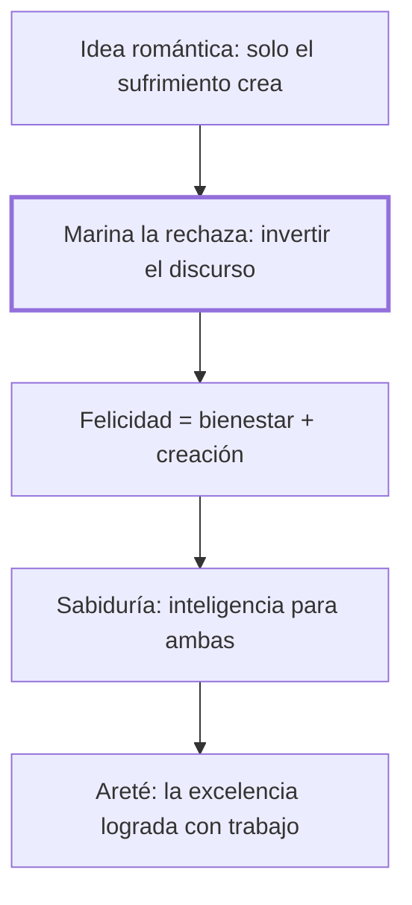

# Epílogo: Elogio de la inteligencia triunfante

## 1. Idea principal

La inteligencia triunfante es la sabiduría, la capacidad de sostener a la vez el bienestar y la creación, en la vida privada y en la justicia.

Este epílogo cierra el libro discutiendo la idea romántica de que solo el sufrimiento crea algo valioso, y propone en cambio la sabiduría como la meta de una inteligencia que triunfa. A un principiante le sirve para cerrar la lectura con una pregunta directa: ¿de verdad hace falta sufrir para ser creativo?

## 2. Lo esencial del capítulo

El epílogo retoma la pregunta que cerraba la Introducción sobre Kafka —¿preferiríamos un Kafka feliz a las obras de un Kafka desdichado?— para desmontar la idea romántica de que solo el sufrimiento crea y de que la felicidad es boba o embrutecedora, una tradición que Marina rastrea desde Nietzsche hasta Heidegger y Sartre (Epílogo). Propone invertir esa tradición e imaginar a Nietzsche feliz, y denuncia que buena parte de esa glorificación del dolor descansa en confundir la felicidad con el simple placer, recordando la frase de Stuart Mill sobre "una felicidad de cerdo" (Epílogo).

Define la felicidad humana como la satisfacción armoniosa de dos aspiraciones que suelen tironear en direcciones distintas, el bienestar y la creación, y llama sabiduría a la inteligencia capaz de sostener ambas a la vez, tanto en la vida privada como en la política, es decir, en la justicia (Epílogo). Retoma el concepto griego de areté —la excelencia que un talento alcanza tras un trabajo minucioso, como la de un músico o un atleta— para sostener que los seres humanos alcanzan su areté básica precisamente en esa sabiduría (Epílogo).

Cierra pidiendo invertir también la manera en que se cuenta la historia: en vez de narrar una vez más la monótona sucesión de crueldades y torpezas, propone contar la historia triunfal de la inteligencia humana (Epílogo). Termina en un tono deliberadamente optimista, confiando en que la inteligencia triunfará salvo que la especie se degrade, y cierra el libro con un poema de Neruda y la fórmula "que así sea" (Epílogo).

## 3. Mapa

## 4. Vocabulario clave

- **Sabiduría** — la inteligencia capaz de sostener a la vez el bienestar y la creación, en la vida privada y en la política (Epílogo).
- **Areté** — la excelencia que un talento alcanza tras un trabajo minucioso y sostenido, como la de un gran músico (Epílogo).
- **Creación** — hacer que exista algo valioso que antes no existía; no hay creación mala, solo destrucción (Epílogo).

## 5. Distinciones que se confunden

- **Sufrimiento vs. esfuerzo (entrenamiento)** — el esfuerzo es un dolor elegido y con sentido, al servicio de un proyecto; el sufrimiento es un dolor sin elección y sin sentido.
  - Se confunden porque: ambos duelen, y la tradición romántica que Marina critica los trata como si fueran la misma fuente de creación (Epílogo).
  - Criterio para decidir: preguntarse si ese dolor se eligió al servicio de una meta propia, o si simplemente se padece sin poder evitarlo ni encontrarle sentido.
  - Dónde se cae: glorificar cualquier padecimiento como "necesario para crear", cuando en realidad solo el esfuerzo elegido cumple esa función.

## 6. Autoevaluación

1. ¿Qué se entiende por sabiduría según Marina, y cómo responde a la pregunta sobre Kafka planteada desde la Introducción?
2. Un joven artista cree que necesita hundirse en el alcohol y la angustia para producir su mejor obra, y rechaza cualquier época estable de su vida por considerarla "poco creativa". Usando la distinción entre sufrimiento y esfuerzo, ¿qué le respondería Marina?

--- No mires esto hasta responder ---

1. La sabiduría es, para Marina, la inteligencia capaz de sostener a la vez el bienestar y la creación, tanto en la vida privada como en la política, es decir, en la justicia (Epílogo). Responde a la pregunta sobre Kafka planteada desde la Introducción invirtiendo la premisa romántica: en vez de asumir que solo el sufrimiento produce una obra valiosa, propone imaginar a un creador feliz y preguntarse si esa felicidad sería realmente un obstáculo (Epílogo; Introducción). Su respuesta es que la idea de que la felicidad embrutece es una trampa conceptual, no un hecho comprobado. Lo que de verdad exige la creación es esfuerzo sostenido, no sufrimiento gratuito.
2. Marina le diría que confunde el esfuerzo con el sufrimiento: el entrenamiento de un bailarín no es sufrimiento, sino un dolor elegido al servicio de un proyecto (Epílogo). El alcohol y la angustia que busca no tienen ese sentido ni esa elección, así que no cumplen la función creadora que él les atribuye. Su error es glorificar cualquier padecimiento como si fuera necesariamente fértil.

## Flashcards

Según Marina, ¿cuáles son las dos aspiraciones cuya satisfacción armoniosa define la felicidad humana? | El bienestar y la creación.
¿Qué es la areté, tal como la retoma Marina de los griegos? | La excelencia que un talento alcanza tras un trabajo minucioso y sostenido.
¿Cómo define Marina la creación? | Hacer que exista algo valioso que antes no existía; no hay creación mala.
¿Qué distingue al esfuerzo del sufrimiento, según el epílogo? | El esfuerzo es un dolor elegido y con sentido; el sufrimiento no se elige ni tiene sentido.
